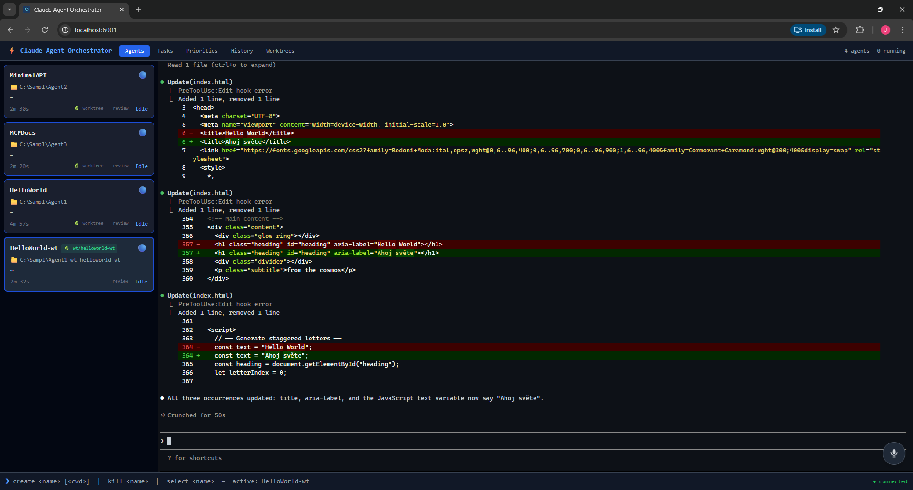

# Claude Agent Orchestrator

A web-based dashboard for managing multiple [Claude Code](https://docs.anthropic.com/en/docs/claude-code) agents simultaneously. Each agent runs in its own pseudo-terminal (PTY) and streams output to the browser via xterm.js &mdash; full color, TUI support, slash commands, and interactive prompts.



## Features

- **Multiple agents at once** &mdash; spawn, monitor, and switch between agents in separate PTY sessions
- **Full terminal emulation** &mdash; xterm.js with 256-color support, resize, and keyboard passthrough
- **Tool approval dialog** &mdash; Claude Code `PreToolUse` hook surfaces every tool call (Bash, Write, Edit, etc.) in a browser dialog for approve/deny
- **Git worktree management** &mdash; create isolated worktrees from agent cards so multiple agents can work on the same repo without conflicts
- **Voice dictation** &mdash; Web Speech API integration for hands-free prompting with image attachments
- **Git review panel** &mdash; inline diff viewer for reviewing agent changes before committing
- **Session history** &mdash; grouped by project, with resume support (`--resume` session IDs)
- **Desktop notifications** &mdash; sound + system notification when an agent goes idle
- **PWA** &mdash; installable as a standalone app from the browser
- **Priority list** &mdash; drag-and-drop task notepad with JSON persistence
- **Markdown Reader** &mdash; open `.md` / `.txt` files via path, drag-drop, or browse; renders GitHub-style Markdown with Mermaid diagrams, syntax highlighting, relative images, TOC with scroll-spy, multi-tab state, live reload, and print-to-PDF

## Quick Start

### Prerequisites

- [.NET 9 SDK](https://dotnet.microsoft.com/download)
- [Node.js](https://nodejs.org/) (LTS)
- [Claude Code CLI](https://docs.anthropic.com/en/docs/claude-code): `npm install -g @anthropic-ai/claude-code`

### Run (development)

```bash
cd claude-orchestrator-web/backend
dotnet run
```

This starts the ASP.NET backend on `http://localhost:6001`, automatically launches the Vite dev server with hot reload, and opens the pty-proxy.

> If it fails with "Vite dev server not available", run `npm install` in `claude-orchestrator-web/frontend/`.

### Run (production)

```bash
cd claude-orchestrator-web/frontend
npm install && npm run build

cd ../backend
dotnet publish -c Release
./bin/Release/net9.0/publish/ClaudeOrchestrator.exe
```

## Usage

### Command bar

Type commands in the bottom bar:

| Command | Description |
|---------|-------------|
| `create <name> [<cwd>]` | Spawn a new agent, optionally in a specific directory |
| `kill <name>` | Terminate an agent |
| `select <name>` | Switch terminal view to an agent |
| `list` | Show all agents and their status |

**Examples:**
```
create backend C:\Projects\MyApp
create frontend C:\Projects\MyApp\client
kill backend
```

### Agent interaction

Click an agent card in the sidebar (or use `select`) and type directly into the terminal. Claude Code confirmation prompts work as normal.

### Worktrees

Click the **🌿 worktree** button on any agent card to create an isolated git worktree. A new agent spawns in the worktree directory (`<project>-wt-<name>/`) on its own branch. Manage all worktrees from the **Worktrees** tab.

### Tool approval

Every tool call from Claude is intercepted via a `PreToolUse` hook and displayed in a modal dialog. You can **Approve**, **Deny**, or **Always Allow** specific tools. Auto-approves after 2 minutes of inactivity.

### Voice dictation

Click the microphone button (bottom-right of the terminal) to dictate prompts using Web Speech API (Chrome/Edge). Optionally attach an image before sending.

### Markdown Reader

Open the **Reader** tab to read Markdown files (design specs, plans, notes) next to your agents without leaving the app.

**Opening files &mdash; two modes:**

- **Full mode** &mdash; click **Open file** and paste an absolute path. The backend serves the content, resolves relative images (`` works), and watches the file on disk &mdash; the preview auto-refreshes when the file changes.
- **Lite mode** &mdash; drag-and-drop a file into the Reader, or use **Browse**. The file is read client-side via the File API. On Chromium browsers (Chrome/Edge) the handle is persisted so **clicking the file in Recent reopens it with a single permission prompt**. On Firefox/Safari the Recent click re-opens the system file picker.

**Features:**

- Mermaid.js diagrams, `highlight.js` syntax highlighting, bordered tables, dark-theme typography
- Multi-tab state persisted in `localStorage` &mdash; tabs come back after reload (full mode re-fetches content)
- Left sidebar with scroll-spy TOC and Recent files (resizable handle)
- **🖨 Print** button generates a paginated, light-theme print view with no app chrome &mdash; save as PDF via the browser print dialog (tip: turn off "Headers and footers" in **More settings**)
- 5 MB file size guard with confirmation prompt

## Architecture

```
Browser (Vue 3 + Pinia + xterm.js)
  ├── AgentCard           — status, worktree badge, folder shortcut
  ├── TerminalPanel       — one xterm.js instance per agent
  ├── PermissionDialog    — tool approval modal (PreToolUse hook)
  ├── VoiceDictateDialog  — speech-to-text with image attachments
  ├── WorktreesView       — git worktree manager
  ├── HistoryView         — grouped session history with resume
  └── ReaderView          — Markdown reader with Mermaid + TOC + multi-tab

ASP.NET Core 9 (SignalR + REST)
  ├── AgentManager        — agent lifecycle, permission queue
  ├── PtySession          — PTY management via node-pty proxy
  ├── WorktreeService     — git worktree add/list/remove
  ├── AgentHistoryService — session persistence with auto-cleanup
  ├── FileWatcherService  — Reader live-reload via FileSystemWatcher → SignalR
  └── Hook injection      — injects/removes hooks in .claude/settings.local.json

pty-proxy (Node.js)
  └── node-pty → ConPTY (Windows) / pty (Linux/macOS)
      └── claude CLI in a real pseudo-terminal
```

### Data flow

```
PTY output → base64 → "DATA:" line → C# → SignalR → atob() → terminal.write()
Keystroke  → terminal.onData → POST /keystroke → C# → "INPUT:" line → PTY stdin
Tool call  → PreToolUse hook → POST /hook/pre-tool → permission dialog → response
```

## Configuration

Default port is `6001`. Change in `backend/appsettings.json`:

```json
{
  "Port": 8080
}
```

Or via environment variable: `Port=8080`

## Tech Stack

- **Backend:** ASP.NET Core 9, SignalR, node-pty (via Node.js proxy)
- **Frontend:** Vue 3 (Composition API), Pinia, xterm.js, Tailwind CSS, Web Speech API, markdown-it + Mermaid.js + highlight.js (Reader), File System Access API
- **Build:** Vite, vite-plugin-pwa
- **Persistence:** JSON files (`data/agents.json`, `data/priorities.json`)

## Platform Support

Currently tested on **Windows** (ConPTY). The architecture supports Linux/macOS via node-pty but has not been tested on those platforms.

## Contributing

See [CONTRIBUTING.md](CONTRIBUTING.md) for development setup and guidelines.

## License

[MIT](LICENSE)
