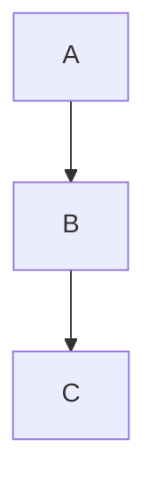

# Reader (Markdown Preview with Mermaid) — Implementation Plan

> **For agentic workers:** REQUIRED SUB-SKILL: Use superpowers:subagent-driven-development (recommended) or superpowers:executing-plans to implement this plan task-by-task. Steps use checkbox (`- [ ]`) syntax for tracking.

**Goal:** Add a "Reader" view that opens `.md`/`.markdown`/`.mdx`/`.txt` files via dialog or drag-and-drop, renders Markdown with Mermaid diagrams, syntax highlighting, relative images, multi-tab state, live reload, and PDF export.

**Architecture:** Hybrid full/lite modes. Full mode = user-supplied absolute path; backend reads content, serves relative images, watches file for changes over SignalR. Lite mode = File API (drag-drop); rendered in-browser, no backend, no relative images, no reload. Tabs and recent files persisted in `localStorage`. PDF via `window.print()` with a print-only stylesheet.

**Tech Stack:** Backend — ASP.NET Core 9 (`ReaderController`, `FileWatcherService`, `ReaderHub`). Frontend — Vue 3 Composition API (JS, not TS), Pinia, markdown-it + markdown-it-anchor, highlight.js, mermaid (lazy), SignalR, Vitest + @vue/test-utils + @testing-library/vue + jsdom.

**Reference spec:** `docs/superpowers/specs/2026-04-14-reader-md-preview-design.md`

---

## Conventions

- **Frontend files are `.js`** (not `.ts`) — the project is plain JavaScript. Types are documented via JSDoc where helpful.
- **Store pattern:** `defineStore('name', () => { ... })` composition API with `ref`/`computed`.
- **Backend namespace:** `ClaudeOrchestrator.Controllers`, `ClaudeOrchestrator.Services`, `ClaudeOrchestrator.Hubs`.
- **DI:** all new services registered as `builder.Services.AddSingleton<T>()` in `Program.cs`.
- **Commits:** one per task unless noted; messages in imperative mood.
- **TDD:** frontend code follows write-failing-test → verify-fails → minimal-impl → verify-passes. Backend has no test project (per spec); verify manually with `curl`.

---

## API Reference (locked in — referenced by all tasks)

### Backend HTTP

| Method | Path | Input | Output |
|---|---|---|---|
| `GET` | `/api/reader/content?path=<abs>` | query `path` | `200 { path, content, mtime }` · `400 { error, allowed? }` · `404 { error, path }` · `500 { error }` |
| `GET` | `/api/reader/raw?path=<abs>` | query `path` | `200` binary + `Content-Type` · `400` · `404` |
| `POST` | `/api/reader/watch` | body `{ path }` | `200` · `400` · `404` |
| `POST` | `/api/reader/unwatch` | body `{ path }` | `200` |

Whitelists:
- `/content`: `.md`, `.markdown`, `.mdx`, `.txt`
- `/raw`: `.png`, `.jpg`, `.jpeg`, `.gif`, `.webp`, `.svg`

### SignalR hub `/hubs/reader`
- Server → client: `FileChanged(path: string, mtime: number)`
- Server → client: `WatchFailed(path: string)`

### Frontend module shapes

```
readerApi.js
  getContent(path) → Promise<{ path, content, mtime }>
  rawUrl(path) → string                // constructs `/api/reader/raw?path=...`
  watch(path) → Promise<void>
  unwatch(path) → Promise<void>

markdownRenderer.js
  createRenderer({ mode, basePath }) → {
    render(md) → { html, headings }     // headings: [{ level, text, id }]
  }
  // mode: 'full' | 'lite'
  // basePath: string | null — directory containing the source MD file (full mode only)

mermaidRenderer.js
  renderAll(container) → Promise<void>  // finds `.mermaid` blocks, renders; on parse error, adds class `mermaid-error`

readerStore (Pinia)
  state: { tabs, activeTabId, recentFiles, sidebarWidth }
  getters: { activeTab }
  actions:
    addTab(tab)
    closeTab(id)
    activateTab(id)
    setScrollY(id, y)
    updateTabHeadings(id, headings)
    openFromPath(path)
    openFromFile(file)
    handleFileChanged(path, mtime)
    addRecent(path, displayName)
    removeRecent(path)
    setSidebarWidth(px)
```

### Tab object shape

```js
/**
 * @typedef {Object} ReaderTab
 * @property {string} id                uuid
 * @property {string|null} path         absolute path, null in lite mode
 * @property {string} displayName       filename
 * @property {string} content           raw Markdown
 * @property {number|null} mtime        file mtime (unix ms) or null
 * @property {'full'|'lite'} mode
 * @property {Array<{level:number,text:string,id:string}>} headings
 * @property {number} scrollY
 */
```

---

## File Structure

### Backend
- **Create:** `claude-orchestrator-web/backend/Controllers/ReaderController.cs`
- **Create:** `claude-orchestrator-web/backend/Services/FileWatcherService.cs`
- **Create:** `claude-orchestrator-web/backend/Hubs/ReaderHub.cs`
- **Modify:** `claude-orchestrator-web/backend/Program.cs` — register service + hub

### Frontend
- **Create:** `claude-orchestrator-web/frontend/src/views/ReaderView.vue`
- **Create:** `claude-orchestrator-web/frontend/src/components/reader/ReaderToolbar.vue`
- **Create:** `claude-orchestrator-web/frontend/src/components/reader/ReaderTabs.vue`
- **Create:** `claude-orchestrator-web/frontend/src/components/reader/ReaderSidebar.vue`
- **Create:** `claude-orchestrator-web/frontend/src/components/reader/ReaderToc.vue`
- **Create:** `claude-orchestrator-web/frontend/src/components/reader/ReaderRecent.vue`
- **Create:** `claude-orchestrator-web/frontend/src/components/reader/ReaderPreview.vue`
- **Create:** `claude-orchestrator-web/frontend/src/components/reader/OpenFileDialog.vue`
- **Create:** `claude-orchestrator-web/frontend/src/components/reader/DropOverlay.vue`
- **Create:** `claude-orchestrator-web/frontend/src/stores/reader.js`
- **Create:** `claude-orchestrator-web/frontend/src/services/readerApi.js`
- **Create:** `claude-orchestrator-web/frontend/src/services/markdownRenderer.js`
- **Create:** `claude-orchestrator-web/frontend/src/services/mermaidRenderer.js`
- **Create:** `claude-orchestrator-web/frontend/src/assets/print.css`
- **Modify:** `claude-orchestrator-web/frontend/src/router/index.js` — add `/reader` route
- **Modify:** `claude-orchestrator-web/frontend/src/App.vue` — add Reader nav link
- **Modify:** `claude-orchestrator-web/frontend/package.json` — add deps and test scripts
- **Create:** `claude-orchestrator-web/frontend/vitest.config.js`
- **Create:** `claude-orchestrator-web/frontend/src/test-setup.js`

### Test files (co-located)
- `claude-orchestrator-web/frontend/src/services/readerApi.test.js`
- `claude-orchestrator-web/frontend/src/services/markdownRenderer.test.js`
- `claude-orchestrator-web/frontend/src/services/mermaidRenderer.test.js`
- `claude-orchestrator-web/frontend/src/stores/reader.test.js`
- `claude-orchestrator-web/frontend/src/components/reader/OpenFileDialog.test.js`
- `claude-orchestrator-web/frontend/src/components/reader/DropOverlay.test.js`
- `claude-orchestrator-web/frontend/src/components/reader/ReaderTabs.test.js`
- `claude-orchestrator-web/frontend/src/components/reader/ReaderToc.test.js`
- `claude-orchestrator-web/frontend/src/components/reader/ReaderRecent.test.js`

---

## Phase 1 — Test stack setup

### Task 1: Install Vitest + helpers, add scripts, write smoke test

**Files:**
- Modify: `claude-orchestrator-web/frontend/package.json`
- Create: `claude-orchestrator-web/frontend/vitest.config.js`
- Create: `claude-orchestrator-web/frontend/src/test-setup.js`
- Create: `claude-orchestrator-web/frontend/src/__tests__/smoke.test.js`

- [ ] **Step 1: Install dev dependencies**

Run:
```bash
cd claude-orchestrator-web/frontend
npm install --save-dev vitest @vue/test-utils @testing-library/vue jsdom @vitest/ui
```

- [ ] **Step 2: Add scripts to `package.json`**

Modify `claude-orchestrator-web/frontend/package.json` — add three entries inside the existing `"scripts"` block (keep existing `dev`, `build`, `preview`):

```json
"scripts": {
  "dev": "vite",
  "build": "vite build",
  "preview": "vite preview",
  "test": "vitest run",
  "test:watch": "vitest",
  "test:ui": "vitest --ui"
}
```

- [ ] **Step 3: Create `vitest.config.js`**

Create `claude-orchestrator-web/frontend/vitest.config.js`:

```js
import { defineConfig } from 'vitest/config'
import vue from '@vitejs/plugin-vue'

export default defineConfig({
  plugins: [vue()],
  test: {
    environment: 'jsdom',
    globals: true,
    setupFiles: ['./src/test-setup.js'],
    include: ['src/**/*.{test,spec}.{js,mjs}'],
  },
})
```

- [ ] **Step 4: Create `test-setup.js`**

Create `claude-orchestrator-web/frontend/src/test-setup.js`:

```js
import { beforeEach } from 'vitest'

beforeEach(() => {
  localStorage.clear()
})
```

- [ ] **Step 5: Write a smoke test**

Create `claude-orchestrator-web/frontend/src/__tests__/smoke.test.js`:

```js
import { describe, it, expect } from 'vitest'

describe('test stack', () => {
  it('runs', () => {
    expect(1 + 1).toBe(2)
  })
  it('has jsdom', () => {
    expect(typeof document).toBe('object')
    const el = document.createElement('div')
    expect(el.tagName).toBe('DIV')
  })
  it('clears localStorage between tests', () => {
    localStorage.setItem('x', '1')
    expect(localStorage.getItem('x')).toBe('1')
  })
})
```

- [ ] **Step 6: Run tests**

Run:
```bash
cd claude-orchestrator-web/frontend && npm test
```
Expected: 3 passing tests.

- [ ] **Step 7: Commit**

```bash
git add claude-orchestrator-web/frontend/package.json \
        claude-orchestrator-web/frontend/package-lock.json \
        claude-orchestrator-web/frontend/vitest.config.js \
        claude-orchestrator-web/frontend/src/test-setup.js \
        claude-orchestrator-web/frontend/src/__tests__/smoke.test.js
git commit -m "chore: add Vitest + @vue/test-utils test stack"
```

---

## Phase 2 — Backend

No backend tests exist in this repo (per spec). Verify each endpoint manually with `curl` and `dotnet run`.

### Task 2: ReaderController — `GET /api/reader/content`

**Files:**
- Create: `claude-orchestrator-web/backend/Controllers/ReaderController.cs`

- [ ] **Step 1: Create the controller with content endpoint**

Create `claude-orchestrator-web/backend/Controllers/ReaderController.cs`:

```csharp
using Microsoft.AspNetCore.Mvc;

namespace ClaudeOrchestrator.Controllers;

[ApiController]
[Route("api/[controller]")]
public class ReaderController : ControllerBase
{
    private static readonly HashSet<string> ContentExtensions =
        new(StringComparer.OrdinalIgnoreCase) { ".md", ".markdown", ".mdx", ".txt" };

    private static readonly HashSet<string> RawExtensions =
        new(StringComparer.OrdinalIgnoreCase)
        { ".png", ".jpg", ".jpeg", ".gif", ".webp", ".svg" };

    [HttpGet("content")]
    public IActionResult GetContent([FromQuery] string? path)
    {
        if (string.IsNullOrWhiteSpace(path))
            return BadRequest(new { error = "Invalid path" });

        string full;
        try { full = Path.GetFullPath(path); }
        catch { return BadRequest(new { error = "Invalid path" }); }

        var ext = Path.GetExtension(full);
        if (!ContentExtensions.Contains(ext))
            return BadRequest(new
            {
                error = "Unsupported extension",
                allowed = ContentExtensions.ToArray()
            });

        if (!System.IO.File.Exists(full))
            return NotFound(new { error = "File not found", path = full });

        try
        {
            var content = System.IO.File.ReadAllText(full);
            var mtime = new DateTimeOffset(System.IO.File.GetLastWriteTimeUtc(full))
                .ToUnixTimeMilliseconds();
            return Ok(new { path = full, content, mtime });
        }
        catch (Exception ex)
        {
            return StatusCode(500, new { error = ex.Message });
        }
    }
}
```

- [ ] **Step 2: Build**

Run:
```bash
cd claude-orchestrator-web/backend && dotnet build
```
Expected: build succeeds.

- [ ] **Step 3: Run backend and verify manually**

Run (in a separate shell):
```bash
cd claude-orchestrator-web/backend && dotnet run
```

Then in another shell:
```bash
# success — CLAUDE.md exists at repo root
curl "http://localhost:5180/api/reader/content?path=$(pwd)/CLAUDE.md"
# 400 on bad extension
curl -i "http://localhost:5180/api/reader/content?path=/etc/hosts"
# 404 on missing
curl -i "http://localhost:5180/api/reader/content?path=/does-not-exist.md"
# 400 on empty
curl -i "http://localhost:5180/api/reader/content?path="
```
Expected: first returns JSON with `path`, `content`, `mtime`; others return 400/404 with JSON error.

> **Note on port:** The actual port is whatever `dotnet run` prints. Adjust accordingly in all manual tests.

- [ ] **Step 4: Commit**

```bash
git add claude-orchestrator-web/backend/Controllers/ReaderController.cs
git commit -m "feat(backend): add ReaderController with /content endpoint"
```

### Task 3: ReaderController — `GET /api/reader/raw`

**Files:**
- Modify: `claude-orchestrator-web/backend/Controllers/ReaderController.cs`

- [ ] **Step 1: Add raw endpoint**

Add the following method inside `ReaderController` (after `GetContent`):

```csharp
[HttpGet("raw")]
public IActionResult GetRaw([FromQuery] string? path)
{
    if (string.IsNullOrWhiteSpace(path))
        return BadRequest(new { error = "Invalid path" });

    string full;
    try { full = Path.GetFullPath(path); }
    catch { return BadRequest(new { error = "Invalid path" }); }

    var ext = Path.GetExtension(full);
    if (!RawExtensions.Contains(ext))
        return BadRequest(new
        {
            error = "Unsupported extension",
            allowed = RawExtensions.ToArray()
        });

    if (!System.IO.File.Exists(full))
        return NotFound(new { error = "File not found", path = full });

    var contentType = ext.ToLowerInvariant() switch
    {
        ".png"  => "image/png",
        ".jpg"  => "image/jpeg",
        ".jpeg" => "image/jpeg",
        ".gif"  => "image/gif",
        ".webp" => "image/webp",
        ".svg"  => "image/svg+xml",
        _ => "application/octet-stream"
    };

    var stream = System.IO.File.OpenRead(full);
    return File(stream, contentType);
}
```

- [ ] **Step 2: Build + manual verify**

Run:
```bash
cd claude-orchestrator-web/backend && dotnet build
```

Then with `dotnet run` active:
```bash
# point at any png on disk; expect binary + Content-Type: image/png
curl -i "http://localhost:5180/api/reader/raw?path=<abs path to a png>"
# 400 on disallowed extension
curl -i "http://localhost:5180/api/reader/raw?path=/tmp/x.exe"
```
Expected: success serves binary with correct content-type; disallowed returns 400.

- [ ] **Step 3: Commit**

```bash
git add claude-orchestrator-web/backend/Controllers/ReaderController.cs
git commit -m "feat(backend): add /api/reader/raw for relative image serving"
```

### Task 4: FileWatcherService + `/watch` + `/unwatch`

**Files:**
- Create: `claude-orchestrator-web/backend/Services/FileWatcherService.cs`
- Modify: `claude-orchestrator-web/backend/Controllers/ReaderController.cs`
- Modify: `claude-orchestrator-web/backend/Program.cs`

- [ ] **Step 1: Create FileWatcherService**

Create `claude-orchestrator-web/backend/Services/FileWatcherService.cs`:

```csharp
using System.Collections.Concurrent;

namespace ClaudeOrchestrator.Services;

public class FileWatcherService : IDisposable
{
    public event Action<string, long>? FileChanged;
    public event Action<string>? WatchFailed;

    private readonly ConcurrentDictionary<string, WatchEntry> _entries = new();
    private readonly object _lock = new();

    private class WatchEntry
    {
        public FileSystemWatcher Watcher = null!;
        public int RefCount;
        public int ConsecutiveFailures;
        public System.Timers.Timer? Debounce;
    }

    public void Watch(string absolutePath)
    {
        var normalized = Path.GetFullPath(absolutePath);
        lock (_lock)
        {
            if (_entries.TryGetValue(normalized, out var existing))
            {
                existing.RefCount++;
                return;
            }

            var dir = Path.GetDirectoryName(normalized)!;
            var name = Path.GetFileName(normalized);
            var w = new FileSystemWatcher(dir, name)
            {
                NotifyFilter = NotifyFilters.LastWrite | NotifyFilters.Size,
                EnableRaisingEvents = true
            };

            var entry = new WatchEntry { Watcher = w, RefCount = 1 };

            w.Changed += (_, __) => OnChanged(normalized, entry);
            w.Error += (_, e) => OnError(normalized, entry);

            _entries[normalized] = entry;
        }
    }

    public void Unwatch(string absolutePath)
    {
        var normalized = Path.GetFullPath(absolutePath);
        lock (_lock)
        {
            if (!_entries.TryGetValue(normalized, out var entry)) return;
            entry.RefCount--;
            if (entry.RefCount <= 0)
            {
                entry.Watcher.EnableRaisingEvents = false;
                entry.Watcher.Dispose();
                entry.Debounce?.Dispose();
                _entries.TryRemove(normalized, out _);
            }
        }
    }

    private void OnChanged(string path, WatchEntry entry)
    {
        // Debounce 100ms — editors often write twice in rapid succession.
        entry.Debounce?.Stop();
        entry.Debounce?.Dispose();
        var t = new System.Timers.Timer(100) { AutoReset = false };
        entry.Debounce = t;
        t.Elapsed += (_, __) =>
        {
            try
            {
                if (!File.Exists(path)) return;
                var mtime = new DateTimeOffset(File.GetLastWriteTimeUtc(path))
                    .ToUnixTimeMilliseconds();
                entry.ConsecutiveFailures = 0;
                FileChanged?.Invoke(path, mtime);
            }
            catch
            {
                entry.ConsecutiveFailures++;
                if (entry.ConsecutiveFailures >= 3)
                    WatchFailed?.Invoke(path);
            }
        };
        t.Start();
    }

    private void OnError(string path, WatchEntry entry)
    {
        entry.ConsecutiveFailures++;
        if (entry.ConsecutiveFailures >= 3)
            WatchFailed?.Invoke(path);
    }

    public void Dispose()
    {
        foreach (var entry in _entries.Values)
        {
            entry.Watcher.Dispose();
            entry.Debounce?.Dispose();
        }
        _entries.Clear();
    }
}
```

- [ ] **Step 2: Register service in Program.cs**

Modify `claude-orchestrator-web/backend/Program.cs` — add alongside the other `AddSingleton` registrations (around line 42–48):

```csharp
builder.Services.AddSingleton<FileWatcherService>();
```

Also add the using at the top if not already present:

```csharp
// ensure this using exists (it likely already does):
// using ClaudeOrchestrator.Services;
```

- [ ] **Step 3: Add watch/unwatch endpoints to controller**

Modify `claude-orchestrator-web/backend/Controllers/ReaderController.cs`:

Add `using ClaudeOrchestrator.Services;` at the top, and add a constructor + the two endpoints:

```csharp
// add at class level:
private readonly FileWatcherService _watcher;

public ReaderController(FileWatcherService watcher)
{
    _watcher = watcher;
}

public record WatchRequest(string Path);

[HttpPost("watch")]
public IActionResult Watch([FromBody] WatchRequest req)
{
    if (string.IsNullOrWhiteSpace(req.Path))
        return BadRequest(new { error = "Invalid path" });

    string full;
    try { full = Path.GetFullPath(req.Path); }
    catch { return BadRequest(new { error = "Invalid path" }); }

    if (!System.IO.File.Exists(full))
        return NotFound(new { error = "File not found", path = full });

    _watcher.Watch(full);
    return Ok();
}

[HttpPost("unwatch")]
public IActionResult Unwatch([FromBody] WatchRequest req)
{
    if (string.IsNullOrWhiteSpace(req.Path)) return Ok();
    string full;
    try { full = Path.GetFullPath(req.Path); }
    catch { return Ok(); }
    _watcher.Unwatch(full);
    return Ok();
}
```

- [ ] **Step 4: Build + manual verify**

```bash
cd claude-orchestrator-web/backend && dotnet build && dotnet run
```

```bash
# Create a test file
echo "# hello" > /tmp/test.md
curl -X POST -H "Content-Type: application/json" \
     -d '{"path":"/tmp/test.md"}' \
     http://localhost:5180/api/reader/watch
# Expect 200
curl -X POST -H "Content-Type: application/json" \
     -d '{"path":"/tmp/test.md"}' \
     http://localhost:5180/api/reader/unwatch
# Expect 200
# 404 on missing
curl -i -X POST -H "Content-Type: application/json" \
     -d '{"path":"/nope.md"}' \
     http://localhost:5180/api/reader/watch
```

- [ ] **Step 5: Commit**

```bash
git add claude-orchestrator-web/backend/Services/FileWatcherService.cs \
        claude-orchestrator-web/backend/Controllers/ReaderController.cs \
        claude-orchestrator-web/backend/Program.cs
git commit -m "feat(backend): add FileWatcherService with /watch /unwatch endpoints"
```

### Task 5: ReaderHub — wire FileChanged/WatchFailed to SignalR

**Files:**
- Create: `claude-orchestrator-web/backend/Hubs/ReaderHub.cs`
- Modify: `claude-orchestrator-web/backend/Program.cs`

- [ ] **Step 1: Create hub**

Create `claude-orchestrator-web/backend/Hubs/ReaderHub.cs`:

```csharp
using Microsoft.AspNetCore.SignalR;

namespace ClaudeOrchestrator.Hubs;

public class ReaderHub : Hub
{
    public override Task OnConnectedAsync() => base.OnConnectedAsync();
}
```

- [ ] **Step 2: Wire FileWatcherService events to hub**

Modify `claude-orchestrator-web/backend/Program.cs` — after `app.MapHub<AgentHub>("/hubs/agents");` (around line 152) add:

```csharp
app.MapHub<ClaudeOrchestrator.Hubs.ReaderHub>("/hubs/reader");

// Wire file-watcher events to the reader hub
var readerHub = app.Services.GetRequiredService<IHubContext<ClaudeOrchestrator.Hubs.ReaderHub>>();
var watcher = app.Services.GetRequiredService<ClaudeOrchestrator.Services.FileWatcherService>();
watcher.FileChanged += (path, mtime) =>
    readerHub.Clients.All.SendAsync("FileChanged", path, mtime);
watcher.WatchFailed += path =>
    readerHub.Clients.All.SendAsync("WatchFailed", path);
```

Add `using Microsoft.AspNetCore.SignalR;` at the top of `Program.cs` if not already present.

- [ ] **Step 3: Build + manual verify**

```bash
cd claude-orchestrator-web/backend && dotnet build && dotnet run
```

Open a browser DevTools console and:

```js
const c = new signalR.HubConnectionBuilder().withUrl('/hubs/reader').build()
c.on('FileChanged', (p,m) => console.log('changed', p, m))
c.on('WatchFailed', p => console.log('failed', p))
await c.start()
```

Then from another shell: start watch on `/tmp/test.md`, append text to it, and observe `FileChanged` in the browser.

```bash
curl -X POST -H "Content-Type: application/json" -d '{"path":"/tmp/test.md"}' http://localhost:5180/api/reader/watch
echo "# updated" >> /tmp/test.md
```

Expected: console logs `changed /tmp/test.md <mtime>`.

- [ ] **Step 4: Commit**

```bash
git add claude-orchestrator-web/backend/Hubs/ReaderHub.cs \
        claude-orchestrator-web/backend/Program.cs
git commit -m "feat(backend): add ReaderHub wiring watcher events to SignalR"
```

---

## Phase 3 — Frontend services (TDD)

### Task 6: `readerApi.js` + tests

**Files:**
- Create: `claude-orchestrator-web/frontend/src/services/readerApi.js`
- Create: `claude-orchestrator-web/frontend/src/services/readerApi.test.js`

- [ ] **Step 1: Write failing tests**

Create `claude-orchestrator-web/frontend/src/services/readerApi.test.js`:

```js
import { describe, it, expect, vi, beforeEach } from 'vitest'
import * as api from './readerApi.js'

describe('readerApi', () => {
  beforeEach(() => {
    vi.restoreAllMocks()
  })

  describe('getContent', () => {
    it('returns parsed payload on success', async () => {
      globalThis.fetch = vi.fn().mockResolvedValue({
        ok: true,
        json: async () => ({ path: '/x.md', content: '# hi', mtime: 1 }),
      })
      const result = await api.getContent('/x.md')
      expect(result).toEqual({ path: '/x.md', content: '# hi', mtime: 1 })
      expect(fetch).toHaveBeenCalledWith(
        '/api/reader/content?path=%2Fx.md'
      )
    })

    it('throws with error message on 4xx/5xx', async () => {
      globalThis.fetch = vi.fn().mockResolvedValue({
        ok: false,
        status: 404,
        json: async () => ({ error: 'File not found', path: '/x.md' }),
      })
      await expect(api.getContent('/x.md')).rejects.toThrow(/File not found/)
    })

    it('throws generic error if response not JSON', async () => {
      globalThis.fetch = vi.fn().mockResolvedValue({
        ok: false,
        status: 500,
        json: async () => { throw new Error('not json') },
      })
      await expect(api.getContent('/x.md')).rejects.toThrow(/500/)
    })
  })

  describe('rawUrl', () => {
    it('builds URL with encoded path', () => {
      expect(api.rawUrl('/a b/c.png')).toBe(
        '/api/reader/raw?path=%2Fa%20b%2Fc.png'
      )
    })
  })

  describe('watch / unwatch', () => {
    it('POSTs watch body', async () => {
      globalThis.fetch = vi.fn().mockResolvedValue({ ok: true, json: async () => ({}) })
      await api.watch('/x.md')
      expect(fetch).toHaveBeenCalledWith('/api/reader/watch', {
        method: 'POST',
        headers: { 'Content-Type': 'application/json' },
        body: JSON.stringify({ path: '/x.md' }),
      })
    })

    it('POSTs unwatch body', async () => {
      globalThis.fetch = vi.fn().mockResolvedValue({ ok: true, json: async () => ({}) })
      await api.unwatch('/x.md')
      expect(fetch).toHaveBeenCalledWith('/api/reader/unwatch', {
        method: 'POST',
        headers: { 'Content-Type': 'application/json' },
        body: JSON.stringify({ path: '/x.md' }),
      })
    })
  })
})
```

- [ ] **Step 2: Run tests — verify they fail**

Run:
```bash
cd claude-orchestrator-web/frontend && npm test -- readerApi
```
Expected: FAIL (module not found).

- [ ] **Step 3: Implement `readerApi.js`**

Create `claude-orchestrator-web/frontend/src/services/readerApi.js`:

```js
async function parseError(res) {
  try {
    const body = await res.json()
    if (body?.error) return new Error(body.error)
  } catch {}
  return new Error(`HTTP ${res.status}`)
}

export async function getContent(path) {
  const res = await fetch(`/api/reader/content?path=${encodeURIComponent(path)}`)
  if (!res.ok) throw await parseError(res)
  return res.json()
}

export function rawUrl(path) {
  return `/api/reader/raw?path=${encodeURIComponent(path)}`
}

export async function watch(path) {
  const res = await fetch('/api/reader/watch', {
    method: 'POST',
    headers: { 'Content-Type': 'application/json' },
    body: JSON.stringify({ path }),
  })
  if (!res.ok) throw await parseError(res)
}

export async function unwatch(path) {
  const res = await fetch('/api/reader/unwatch', {
    method: 'POST',
    headers: { 'Content-Type': 'application/json' },
    body: JSON.stringify({ path }),
  })
  if (!res.ok) throw await parseError(res)
}
```

- [ ] **Step 4: Run tests — verify they pass**

```bash
npm test -- readerApi
```
Expected: all pass.

- [ ] **Step 5: Commit**

```bash
git add claude-orchestrator-web/frontend/src/services/readerApi.js \
        claude-orchestrator-web/frontend/src/services/readerApi.test.js
git commit -m "feat(frontend): add readerApi wrapper with tests"
```

### Task 7: `markdownRenderer.js` — base render + headings extraction

**Files:**
- Create: `claude-orchestrator-web/frontend/src/services/markdownRenderer.js`
- Create: `claude-orchestrator-web/frontend/src/services/markdownRenderer.test.js`

- [ ] **Step 1: Install runtime deps**

Run:
```bash
cd claude-orchestrator-web/frontend
npm install markdown-it markdown-it-anchor highlight.js uuid
```

- [ ] **Step 2: Write failing tests (base rendering + headings)**

Create `claude-orchestrator-web/frontend/src/services/markdownRenderer.test.js`:

```js
import { describe, it, expect } from 'vitest'
import { createRenderer } from './markdownRenderer.js'

describe('markdownRenderer (base)', () => {
  const r = createRenderer({ mode: 'full', basePath: '/docs' })

  it('renders paragraphs and inline formatting', () => {
    const { html } = r.render('hello **world**')
    expect(html).toContain('<p>')
    expect(html).toContain('<strong>world</strong>')
  })

  it('extracts headings with level, text, id', () => {
    const md = '# A\n\n## B one\n\n### C'
    const { headings } = r.render(md)
    expect(headings).toEqual([
      { level: 1, text: 'A', id: expect.any(String) },
      { level: 2, text: 'B one', id: expect.any(String) },
      { level: 3, text: 'C', id: expect.any(String) },
    ])
    // anchors injected into HTML
    const { html } = r.render(md)
    expect(html).toMatch(/<h1 id="[^"]+">A<\/h1>/)
  })

  it('highlights code blocks with known language', () => {
    const { html } = r.render('```js\nconst x = 1\n```')
    expect(html).toContain('hljs')
    expect(html).toContain('const')
  })

  it('escapes HTML in unknown language code blocks', () => {
    const { html } = r.render('```\n<script>alert(1)</script>\n```')
    expect(html).not.toContain('<script>alert(1)</script>')
    expect(html).toContain('&lt;script&gt;')
  })
})
```

- [ ] **Step 3: Run tests — verify they fail**

```bash
npm test -- markdownRenderer
```
Expected: FAIL (module not found).

- [ ] **Step 4: Implement base renderer**

Create `claude-orchestrator-web/frontend/src/services/markdownRenderer.js`:

```js
import MarkdownIt from 'markdown-it'
import anchor from 'markdown-it-anchor'
import hljs from 'highlight.js'

function slugify(s) {
  return s.toLowerCase()
    .replace(/[^\w\s-]/g, '')
    .trim()
    .replace(/\s+/g, '-')
}

export function createRenderer({ mode, basePath }) {
  const md = new MarkdownIt({
    html: false,
    linkify: true,
    breaks: false,
    highlight(str, lang) {
      if (lang === 'mermaid') {
        return `<div class="mermaid">${escapeHtml(str)}</div>`
      }
      if (lang && hljs.getLanguage(lang)) {
        try {
          return `<pre class="hljs"><code>${
            hljs.highlight(str, { language: lang, ignoreIllegals: true }).value
          }</code></pre>`
        } catch {}
      }
      return `<pre class="hljs"><code>${escapeHtml(str)}</code></pre>`
    },
  })

  md.use(anchor, { slugify })

  // Headings accumulator lives per-render, populated by a custom rule.
  let headings = []
  const origHeadingOpen = md.renderer.rules.heading_open
  md.renderer.rules.heading_open = function (tokens, idx, options, env, self) {
    const token = tokens[idx]
    const inline = tokens[idx + 1]
    const text = inline.children
      .filter(t => t.type === 'text' || t.type === 'code_inline')
      .map(t => t.content)
      .join('')
    const id = token.attrGet('id') || slugify(text)
    if (!token.attrGet('id')) token.attrSet('id', id)
    headings.push({
      level: Number(token.tag.slice(1)),
      text,
      id,
    })
    return origHeadingOpen
      ? origHeadingOpen(tokens, idx, options, env, self)
      : self.renderToken(tokens, idx, options)
  }

  return {
    render(src) {
      headings = []
      const html = md.render(src)
      return { html, headings: [...headings] }
    },
  }
}

function escapeHtml(s) {
  return s
    .replace(/&/g, '&amp;')
    .replace(/</g, '&lt;')
    .replace(/>/g, '&gt;')
    .replace(/"/g, '&quot;')
    .replace(/'/g, '&#39;')
}
```

- [ ] **Step 5: Run tests — verify they pass**

```bash
npm test -- markdownRenderer
```
Expected: all 4 pass.

- [ ] **Step 6: Commit**

```bash
git add claude-orchestrator-web/frontend/src/services/markdownRenderer.js \
        claude-orchestrator-web/frontend/src/services/markdownRenderer.test.js \
        claude-orchestrator-web/frontend/package.json \
        claude-orchestrator-web/frontend/package-lock.json
git commit -m "feat(frontend): add markdownRenderer base with headings + highlighting"
```

### Task 8: `markdownRenderer` — image rewriting + Mermaid block

**Files:**
- Modify: `claude-orchestrator-web/frontend/src/services/markdownRenderer.js`
- Modify: `claude-orchestrator-web/frontend/src/services/markdownRenderer.test.js`

- [ ] **Step 1: Add failing tests for image rewriting + mermaid**

Append to `markdownRenderer.test.js`:

```js
describe('markdownRenderer (images + mermaid)', () => {
  it('rewrites relative image src to /api/reader/raw in full mode', () => {
    const r = createRenderer({ mode: 'full', basePath: 'C:/docs' })
    const { html } = r.render('')
    // Path-separator-agnostic: we expect basePath + img.png in the query
    expect(html).toMatch(/\/api\/reader\/raw\?path=/)
    expect(decodeURIComponent(html)).toContain('C:/docs')
    expect(decodeURIComponent(html)).toContain('img.png')
  })

  it('leaves absolute URLs untouched in full mode', () => {
    const r = createRenderer({ mode: 'full', basePath: 'C:/docs' })
    const { html } = r.render('')
    expect(html).toContain('src="https://example.com/x.png"')
  })

  it('replaces relative image with placeholder in lite mode', () => {
    const r = createRenderer({ mode: 'lite', basePath: null })
    const { html } = r.render('')
    expect(html).toContain('data-placeholder="lite-mode"')
    expect(html).not.toContain('./img.png')
  })

  it('transforms ```mermaid fenced block into <div class="mermaid">', () => {
    const r = createRenderer({ mode: 'full', basePath: '/docs' })
    const { html } = r.render('```mermaid\ngraph TD\nA-->B\n```')
    expect(html).toContain('<div class="mermaid">')
    expect(html).toContain('graph TD')
  })
})
```

- [ ] **Step 2: Run tests — verify first three fail, fourth may already pass**

```bash
npm test -- markdownRenderer
```
Expected: image tests fail, mermaid test already passes from Task 7.

- [ ] **Step 3: Extend renderer with image rule**

In `markdownRenderer.js`, inside `createRenderer` **after** the heading rule override, add an image rule:

```js
// Image src rewriting
const defaultImageRender = md.renderer.rules.image
  || function (tokens, idx, options, env, self) { return self.renderToken(tokens, idx, options) }

md.renderer.rules.image = function (tokens, idx, options, env, self) {
  const token = tokens[idx]
  const srcIndex = token.attrIndex('src')
  const src = srcIndex >= 0 ? token.attrs[srcIndex][1] : ''
  if (isAbsoluteUrl(src)) {
    return defaultImageRender(tokens, idx, options, env, self)
  }
  if (mode === 'lite') {
    token.attrSet('src', '')
    token.attrSet('data-placeholder', 'lite-mode')
    token.attrSet('title', 'Image not loaded — lite mode (drag-drop). Open via path dialog for images.')
  } else {
    const resolved = resolveRelative(basePath, src)
    token.attrs[srcIndex][1] = `/api/reader/raw?path=${encodeURIComponent(resolved)}`
  }
  return defaultImageRender(tokens, idx, options, env, self)
}
```

Add these helpers at module scope (below `slugify`):

```js
function isAbsoluteUrl(s) {
  return /^(https?:|data:|blob:|\/)/.test(s)
}

function resolveRelative(base, rel) {
  if (!base) return rel
  // Normalise separators to '/'; allow backslashes in input (Windows paths).
  const b = base.replace(/\\/g, '/').replace(/\/+$/, '')
  const r = rel.replace(/\\/g, '/').replace(/^\.\//, '')
  // Walk '..' segments
  const parts = (b + '/' + r).split('/')
  const out = []
  for (const p of parts) {
    if (p === '..') out.pop()
    else if (p !== '.' && p !== '') out.push(p)
  }
  // Preserve leading separator for non-Windows absolute paths
  const leading = b.startsWith('/') ? '/' : ''
  return leading + out.join('/')
}
```

- [ ] **Step 4: Run tests — verify all pass**

```bash
npm test -- markdownRenderer
```
Expected: all 8 pass.

- [ ] **Step 5: Commit**

```bash
git add claude-orchestrator-web/frontend/src/services/markdownRenderer.js \
        claude-orchestrator-web/frontend/src/services/markdownRenderer.test.js
git commit -m "feat(frontend): rewrite relative image src for full/lite mode"
```

### Task 9: `mermaidRenderer.js` — lazy wrapper + renderAll

**Files:**
- Create: `claude-orchestrator-web/frontend/src/services/mermaidRenderer.js`
- Create: `claude-orchestrator-web/frontend/src/services/mermaidRenderer.test.js`

- [ ] **Step 1: Install mermaid**

```bash
cd claude-orchestrator-web/frontend && npm install mermaid
```

- [ ] **Step 2: Write failing tests**

Create `claude-orchestrator-web/frontend/src/services/mermaidRenderer.test.js`:

```js
import { describe, it, expect, vi, beforeEach } from 'vitest'

vi.mock('mermaid', () => ({
  default: {
    initialize: vi.fn(),
    run: vi.fn(async ({ nodes }) => {
      // Simulate mermaid filling in an SVG
      for (const n of nodes) n.innerHTML = '<svg data-mock="mermaid"></svg>'
    }),
  },
}))

import { renderAll } from './mermaidRenderer.js'

describe('mermaidRenderer', () => {
  beforeEach(() => {
    document.body.innerHTML = ''
  })

  it('renders all .mermaid nodes in container', async () => {
    const c = document.createElement('div')
    c.innerHTML = '<div class="mermaid">graph</div><div class="mermaid">other</div>'
    document.body.appendChild(c)
    await renderAll(c)
    const svgs = c.querySelectorAll('svg[data-mock="mermaid"]')
    expect(svgs.length).toBe(2)
  })

  it('is safe to call on a container with no mermaid nodes', async () => {
    const c = document.createElement('div')
    c.innerHTML = '<p>nothing</p>'
    await expect(renderAll(c)).resolves.toBeUndefined()
  })

  it('adds class mermaid-error on parse failure', async () => {
    const mermaid = (await import('mermaid')).default
    mermaid.run.mockImplementationOnce(async () => { throw new Error('parse err') })
    const c = document.createElement('div')
    c.innerHTML = '<div class="mermaid">bad</div>'
    document.body.appendChild(c)
    await renderAll(c)
    const node = c.querySelector('.mermaid')
    expect(node.classList.contains('mermaid-error')).toBe(true)
    expect(node.textContent).toMatch(/parse err/)
  })
})
```

- [ ] **Step 3: Run tests — verify they fail**

```bash
npm test -- mermaidRenderer
```
Expected: FAIL (module not found).

- [ ] **Step 4: Implement renderer**

Create `claude-orchestrator-web/frontend/src/services/mermaidRenderer.js`:

```js
let _mermaid = null
let _initialized = false

async function getMermaid() {
  if (_mermaid) return _mermaid
  const mod = await import('mermaid')
  _mermaid = mod.default
  if (!_initialized) {
    _mermaid.initialize({
      startOnLoad: false,
      theme: 'dark',
      securityLevel: 'strict',
    })
    _initialized = true
  }
  return _mermaid
}

export async function renderAll(container) {
  const nodes = Array.from(container.querySelectorAll('.mermaid:not(.mermaid-error)'))
  if (nodes.length === 0) return
  const mermaid = await getMermaid()
  try {
    await mermaid.run({ nodes })
  } catch (err) {
    for (const n of nodes) {
      if (!n.querySelector('svg')) {
        n.classList.add('mermaid-error')
        n.textContent = `Mermaid error: ${err?.message || err}`
      }
    }
  }
}
```

- [ ] **Step 5: Run tests — verify they pass**

```bash
npm test -- mermaidRenderer
```
Expected: 3 pass.

- [ ] **Step 6: Commit**

```bash
git add claude-orchestrator-web/frontend/src/services/mermaidRenderer.js \
        claude-orchestrator-web/frontend/src/services/mermaidRenderer.test.js \
        claude-orchestrator-web/frontend/package.json \
        claude-orchestrator-web/frontend/package-lock.json
git commit -m "feat(frontend): add lazy mermaid renderer wrapper"
```

---

## Phase 4 — Pinia store (TDD)

### Task 10: `reader` store — tab lifecycle (addTab/closeTab/activateTab)

**Files:**
- Create: `claude-orchestrator-web/frontend/src/stores/reader.js`
- Create: `claude-orchestrator-web/frontend/src/stores/reader.test.js`

- [ ] **Step 1: Write failing tests**

Create `claude-orchestrator-web/frontend/src/stores/reader.test.js`:

```js
import { describe, it, expect, beforeEach } from 'vitest'
import { setActivePinia, createPinia } from 'pinia'
import { useReaderStore } from './reader.js'

function mkTab(partial = {}) {
  return {
    path: partial.path ?? '/a.md',
    displayName: partial.displayName ?? 'a.md',
    content: partial.content ?? '# a',
    mtime: partial.mtime ?? 1,
    mode: partial.mode ?? 'full',
  }
}

describe('reader store — tab lifecycle', () => {
  beforeEach(() => setActivePinia(createPinia()))

  it('adds a new tab and activates it', () => {
    const s = useReaderStore()
    const id = s.addTab(mkTab())
    expect(s.tabs.length).toBe(1)
    expect(s.activeTabId).toBe(id)
    expect(s.tabs[0].id).toBe(id)
    expect(s.tabs[0].headings).toEqual([])
    expect(s.tabs[0].scrollY).toBe(0)
  })

  it('dedupes by path — reopening same path activates existing tab', () => {
    const s = useReaderStore()
    const id1 = s.addTab(mkTab({ path: '/a.md' }))
    s.addTab(mkTab({ path: '/b.md' }))
    const id3 = s.addTab(mkTab({ path: '/a.md', content: 'new' }))
    expect(s.tabs.length).toBe(2)
    expect(id3).toBe(id1)
    expect(s.activeTabId).toBe(id1)
    // content is refreshed for the deduped tab
    expect(s.tabs.find(t => t.id === id1).content).toBe('new')
  })

  it('does NOT dedupe lite tabs (path=null)', () => {
    const s = useReaderStore()
    s.addTab(mkTab({ path: null, mode: 'lite' }))
    s.addTab(mkTab({ path: null, mode: 'lite' }))
    expect(s.tabs.length).toBe(2)
  })

  it('closeTab removes and activates sibling', () => {
    const s = useReaderStore()
    const a = s.addTab(mkTab({ path: '/a.md' }))
    const b = s.addTab(mkTab({ path: '/b.md' }))
    s.activateTab(a)
    s.closeTab(a)
    expect(s.tabs.length).toBe(1)
    expect(s.activeTabId).toBe(b)
  })

  it('closing the last tab leaves activeTabId null', () => {
    const s = useReaderStore()
    const a = s.addTab(mkTab())
    s.closeTab(a)
    expect(s.tabs.length).toBe(0)
    expect(s.activeTabId).toBeNull()
  })

  it('closing an inactive tab does not change active', () => {
    const s = useReaderStore()
    const a = s.addTab(mkTab({ path: '/a.md' }))
    const b = s.addTab(mkTab({ path: '/b.md' }))
    s.activateTab(a)
    s.closeTab(b)
    expect(s.activeTabId).toBe(a)
  })

  it('activeTab getter returns the active tab object', () => {
    const s = useReaderStore()
    const a = s.addTab(mkTab({ path: '/a.md' }))
    expect(s.activeTab.id).toBe(a)
  })
})
```

- [ ] **Step 2: Run tests — verify they fail**

```bash
npm test -- stores/reader
```
Expected: FAIL (module not found).

- [ ] **Step 3: Implement store (tab lifecycle portion only)**

Create `claude-orchestrator-web/frontend/src/stores/reader.js`:

```js
import { defineStore } from 'pinia'
import { ref, computed } from 'vue'
import { v4 as uuid } from 'uuid'

export const useReaderStore = defineStore('reader', () => {
  const tabs = ref([])
  const activeTabId = ref(null)
  const recentFiles = ref([])
  const sidebarWidth = ref(260)

  const activeTab = computed(() =>
    tabs.value.find(t => t.id === activeTabId.value) || null
  )

  function addTab(partial) {
    // Dedupe by path (full-mode only — path !== null)
    if (partial.path) {
      const existing = tabs.value.find(t => t.path === partial.path)
      if (existing) {
        existing.content = partial.content
        existing.mtime = partial.mtime ?? existing.mtime
        existing.displayName = partial.displayName ?? existing.displayName
        activeTabId.value = existing.id
        return existing.id
      }
    }
    const tab = {
      id: uuid(),
      path: partial.path ?? null,
      displayName: partial.displayName ?? 'Untitled',
      content: partial.content ?? '',
      mtime: partial.mtime ?? null,
      mode: partial.mode ?? 'full',
      headings: [],
      scrollY: 0,
    }
    tabs.value.push(tab)
    activeTabId.value = tab.id
    return tab.id
  }

  function closeTab(id) {
    const idx = tabs.value.findIndex(t => t.id === id)
    if (idx < 0) return
    const wasActive = activeTabId.value === id
    tabs.value.splice(idx, 1)
    if (wasActive) {
      if (tabs.value.length === 0) activeTabId.value = null
      else activeTabId.value = tabs.value[Math.min(idx, tabs.value.length - 1)].id
    }
  }

  function activateTab(id) {
    if (tabs.value.some(t => t.id === id)) activeTabId.value = id
  }

  return {
    tabs, activeTabId, recentFiles, sidebarWidth,
    activeTab,
    addTab, closeTab, activateTab,
  }
})
```

- [ ] **Step 4: Verify tests pass**

```bash
npm test -- stores/reader
```
Expected: all 7 pass.

- [ ] **Step 5: Commit**

```bash
git add claude-orchestrator-web/frontend/src/stores/reader.js \
        claude-orchestrator-web/frontend/src/stores/reader.test.js
git commit -m "feat(frontend): add reader store with tab lifecycle"
```

### Task 11: `reader` store — recent files + sidebar width + misc setters

**Files:**
- Modify: `claude-orchestrator-web/frontend/src/stores/reader.js`
- Modify: `claude-orchestrator-web/frontend/src/stores/reader.test.js`

- [ ] **Step 1: Append failing tests**

Append to `reader.test.js`:

```js
describe('reader store — recent files', () => {
  beforeEach(() => setActivePinia(createPinia()))

  it('adds to recent with openedAt and dedupes by path', () => {
    const s = useReaderStore()
    s.addRecent('/a.md', 'a.md')
    s.addRecent('/b.md', 'b.md')
    s.addRecent('/a.md', 'a.md')
    expect(s.recentFiles.length).toBe(2)
    // most recent first
    expect(s.recentFiles[0].path).toBe('/a.md')
    expect(s.recentFiles[1].path).toBe('/b.md')
  })

  it('caps recent at 20 entries, dropping oldest', () => {
    const s = useReaderStore()
    for (let i = 0; i < 25; i++) s.addRecent(`/f${i}.md`, `f${i}.md`)
    expect(s.recentFiles.length).toBe(20)
    expect(s.recentFiles[0].path).toBe('/f24.md')
    expect(s.recentFiles[19].path).toBe('/f5.md')
  })

  it('removeRecent deletes by path', () => {
    const s = useReaderStore()
    s.addRecent('/a.md', 'a.md')
    s.addRecent('/b.md', 'b.md')
    s.removeRecent('/a.md')
    expect(s.recentFiles.map(r => r.path)).toEqual(['/b.md'])
  })
})

describe('reader store — misc setters', () => {
  beforeEach(() => setActivePinia(createPinia()))

  it('setSidebarWidth clamps to [160, 600]', () => {
    const s = useReaderStore()
    s.setSidebarWidth(100)
    expect(s.sidebarWidth).toBe(160)
    s.setSidebarWidth(999)
    expect(s.sidebarWidth).toBe(600)
    s.setSidebarWidth(300)
    expect(s.sidebarWidth).toBe(300)
  })

  it('setScrollY updates scroll on the tab', () => {
    const s = useReaderStore()
    const id = s.addTab({ path: '/a.md', displayName: 'a', content: '', mode: 'full' })
    s.setScrollY(id, 420)
    expect(s.tabs[0].scrollY).toBe(420)
  })

  it('updateTabHeadings sets headings on the tab', () => {
    const s = useReaderStore()
    const id = s.addTab({ path: '/a.md', displayName: 'a', content: '', mode: 'full' })
    s.updateTabHeadings(id, [{ level: 1, text: 'T', id: 't' }])
    expect(s.tabs[0].headings).toEqual([{ level: 1, text: 'T', id: 't' }])
  })
})
```

- [ ] **Step 2: Run tests — verify new ones fail**

```bash
npm test -- stores/reader
```
Expected: FAIL on new tests.

- [ ] **Step 3: Add actions to store**

In `reader.js`, add inside the store body (before the `return` statement):

```js
function addRecent(path, displayName) {
  const existingIdx = recentFiles.value.findIndex(r => r.path === path)
  if (existingIdx >= 0) recentFiles.value.splice(existingIdx, 1)
  recentFiles.value.unshift({ path, displayName, openedAt: Date.now() })
  if (recentFiles.value.length > 20) recentFiles.value.length = 20
}

function removeRecent(path) {
  recentFiles.value = recentFiles.value.filter(r => r.path !== path)
}

function setSidebarWidth(px) {
  sidebarWidth.value = Math.min(600, Math.max(160, Math.round(px)))
}

function setScrollY(id, y) {
  const tab = tabs.value.find(t => t.id === id)
  if (tab) tab.scrollY = y
}

function updateTabHeadings(id, headings) {
  const tab = tabs.value.find(t => t.id === id)
  if (tab) tab.headings = headings
}
```

Extend the `return` block to include them:

```js
return {
  tabs, activeTabId, recentFiles, sidebarWidth,
  activeTab,
  addTab, closeTab, activateTab,
  addRecent, removeRecent,
  setSidebarWidth, setScrollY, updateTabHeadings,
}
```

- [ ] **Step 4: Verify tests pass**

```bash
npm test -- stores/reader
```
Expected: all 13 tests pass.

- [ ] **Step 5: Commit**

```bash
git add claude-orchestrator-web/frontend/src/stores/reader.js \
        claude-orchestrator-web/frontend/src/stores/reader.test.js
git commit -m "feat(frontend): add recent files + misc setters to reader store"
```

### Task 12: `reader` store — persistence (localStorage)

**Files:**
- Modify: `claude-orchestrator-web/frontend/src/stores/reader.js`
- Modify: `claude-orchestrator-web/frontend/src/stores/reader.test.js`

- [ ] **Step 1: Append failing tests**

Append to `reader.test.js`:

```js
describe('reader store — persistence', () => {
  const KEY = 'claude-orchestrator-reader-state-v1'

  beforeEach(() => {
    setActivePinia(createPinia())
    localStorage.clear()
  })

  it('persist writes full tabs (without content), recent, width', () => {
    const s = useReaderStore()
    s.addTab({ path: '/a.md', displayName: 'a.md', content: 'XX', mode: 'full', mtime: 7 })
    s.addTab({ path: null, displayName: 'b.md', content: 'YY', mode: 'lite' }) // lite NOT persisted
    s.addRecent('/a.md', 'a.md')
    s.setSidebarWidth(333)
    s.persist()
    const raw = JSON.parse(localStorage.getItem(KEY))
    expect(raw.tabs.length).toBe(1)
    expect(raw.tabs[0].path).toBe('/a.md')
    expect(raw.tabs[0].content).toBeUndefined()
    expect(raw.recentFiles.length).toBe(1)
    expect(raw.sidebarWidth).toBe(333)
  })

  it('hydrate restores recent + width and tab stubs (content empty pending re-fetch)', () => {
    localStorage.setItem(KEY, JSON.stringify({
      tabs: [{ id: 'x', path: '/a.md', displayName: 'a.md', mtime: 1, mode: 'full' }],
      activeTabId: 'x',
      recentFiles: [{ path: '/a.md', displayName: 'a.md', openedAt: 1 }],
      sidebarWidth: 400,
    }))
    const s = useReaderStore()
    s.hydrate()
    expect(s.tabs.length).toBe(1)
    expect(s.tabs[0].content).toBe('')
    expect(s.tabs[0].headings).toEqual([])
    expect(s.activeTabId).toBe('x')
    expect(s.sidebarWidth).toBe(400)
    expect(s.recentFiles.length).toBe(1)
  })

  it('hydrate tolerates corrupt JSON', () => {
    localStorage.setItem(KEY, '<<not json>>')
    const s = useReaderStore()
    expect(() => s.hydrate()).not.toThrow()
    expect(s.tabs.length).toBe(0)
  })

  it('hydrate tolerates missing fields', () => {
    localStorage.setItem(KEY, JSON.stringify({ tabs: [] }))
    const s = useReaderStore()
    s.hydrate()
    expect(s.sidebarWidth).toBe(260) // default
    expect(s.recentFiles).toEqual([])
  })
})
```

- [ ] **Step 2: Run tests — verify they fail**

```bash
npm test -- stores/reader
```
Expected: FAIL (persist/hydrate missing).

- [ ] **Step 3: Add persistence actions**

In `reader.js`, add inside store body:

```js
const STORAGE_KEY = 'claude-orchestrator-reader-state-v1'

function persist() {
  const payload = {
    tabs: tabs.value
      .filter(t => t.mode === 'full' && t.path)
      .map(({ content, headings, scrollY, ...rest }) => rest),
    activeTabId: activeTabId.value,
    recentFiles: recentFiles.value,
    sidebarWidth: sidebarWidth.value,
  }
  try { localStorage.setItem(STORAGE_KEY, JSON.stringify(payload)) } catch {}
}

function hydrate() {
  let raw
  try { raw = JSON.parse(localStorage.getItem(STORAGE_KEY) || 'null') } catch { raw = null }
  if (!raw || typeof raw !== 'object') return
  if (Array.isArray(raw.tabs)) {
    tabs.value = raw.tabs.map(t => ({
      id: t.id,
      path: t.path ?? null,
      displayName: t.displayName ?? 'Untitled',
      content: '',
      mtime: t.mtime ?? null,
      mode: 'full',
      headings: [],
      scrollY: 0,
    }))
  }
  if (typeof raw.activeTabId === 'string') activeTabId.value = raw.activeTabId
  if (Array.isArray(raw.recentFiles)) recentFiles.value = raw.recentFiles
  if (typeof raw.sidebarWidth === 'number') sidebarWidth.value = raw.sidebarWidth
}
```

Add to the `return` block: `persist, hydrate`.

- [ ] **Step 4: Verify tests pass**

```bash
npm test -- stores/reader
```

- [ ] **Step 5: Commit**

```bash
git add claude-orchestrator-web/frontend/src/stores/reader.js \
        claude-orchestrator-web/frontend/src/stores/reader.test.js
git commit -m "feat(frontend): persist reader store state to localStorage"
```

### Task 13: `reader` store — async actions (openFromPath, openFromFile, handleFileChanged)

**Files:**
- Modify: `claude-orchestrator-web/frontend/src/stores/reader.js`
- Modify: `claude-orchestrator-web/frontend/src/stores/reader.test.js`

- [ ] **Step 1: Append failing tests**

Append to `reader.test.js`:

```js
import { vi } from 'vitest'
vi.mock('../services/readerApi.js', () => ({
  getContent: vi.fn(),
  watch: vi.fn(),
  unwatch: vi.fn(),
  rawUrl: (p) => `/api/reader/raw?path=${encodeURIComponent(p)}`,
}))

import * as readerApi from '../services/readerApi.js'

describe('reader store — async actions', () => {
  beforeEach(() => {
    setActivePinia(createPinia())
    vi.clearAllMocks()
  })

  it('openFromPath fetches content, adds tab, calls watch, adds recent', async () => {
    readerApi.getContent.mockResolvedValue({ path: '/a.md', content: '# hi', mtime: 42 })
    readerApi.watch.mockResolvedValue()
    const s = useReaderStore()
    const id = await s.openFromPath('/a.md')
    expect(readerApi.getContent).toHaveBeenCalledWith('/a.md')
    expect(readerApi.watch).toHaveBeenCalledWith('/a.md')
    expect(s.tabs[0].content).toBe('# hi')
    expect(s.tabs[0].mode).toBe('full')
    expect(s.activeTabId).toBe(id)
    expect(s.recentFiles[0].path).toBe('/a.md')
  })

  it('openFromPath propagates fetch errors and does not add a tab', async () => {
    readerApi.getContent.mockRejectedValue(new Error('File not found'))
    const s = useReaderStore()
    await expect(s.openFromPath('/nope.md')).rejects.toThrow(/not found/)
    expect(s.tabs.length).toBe(0)
  })

  it('openFromFile reads File via FileReader and adds a lite tab', async () => {
    const file = new File(['# from disk'], 'note.md', { type: 'text/markdown' })
    const s = useReaderStore()
    const id = await s.openFromFile(file)
    expect(s.tabs[0].mode).toBe('lite')
    expect(s.tabs[0].path).toBeNull()
    expect(s.tabs[0].displayName).toBe('note.md')
    expect(s.tabs[0].content).toBe('# from disk')
    expect(s.activeTabId).toBe(id)
  })

  it('handleFileChanged refetches content for matching tab and preserves scrollY', async () => {
    readerApi.getContent.mockResolvedValueOnce({ path: '/a.md', content: 'v1', mtime: 1 })
    readerApi.watch.mockResolvedValue()
    const s = useReaderStore()
    const id = await s.openFromPath('/a.md')
    s.setScrollY(id, 123)
    readerApi.getContent.mockResolvedValueOnce({ path: '/a.md', content: 'v2', mtime: 2 })
    await s.handleFileChanged('/a.md', 2)
    const t = s.tabs.find(t => t.id === id)
    expect(t.content).toBe('v2')
    expect(t.mtime).toBe(2)
    expect(t.scrollY).toBe(123)
  })

  it('handleFileChanged is a no-op if no tab matches the path', async () => {
    const s = useReaderStore()
    await s.handleFileChanged('/unknown.md', 9)
    expect(readerApi.getContent).not.toHaveBeenCalled()
  })

  it('closeTab on full-mode tab calls unwatch', async () => {
    readerApi.getContent.mockResolvedValue({ path: '/a.md', content: 'x', mtime: 1 })
    readerApi.watch.mockResolvedValue()
    readerApi.unwatch.mockResolvedValue()
    const s = useReaderStore()
    const id = await s.openFromPath('/a.md')
    s.closeTab(id)
    expect(readerApi.unwatch).toHaveBeenCalledWith('/a.md')
  })
})
```

- [ ] **Step 2: Run tests — verify they fail**

```bash
npm test -- stores/reader
```

- [ ] **Step 3: Add async actions and adjust closeTab to call unwatch**

In `reader.js`:

1. Add import at top:

```js
import * as readerApi from '../services/readerApi.js'
```

2. Add new actions inside the store:

```js
async function openFromPath(path) {
  const { path: abs, content, mtime } = await readerApi.getContent(path)
  const displayName = abs.split(/[\\/]/).pop()
  const id = addTab({ path: abs, content, mtime, mode: 'full', displayName })
  try { await readerApi.watch(abs) } catch {}
  addRecent(abs, displayName)
  return id
}

function readFile(file) {
  return new Promise((resolve, reject) => {
    const fr = new FileReader()
    fr.onload = () => resolve(String(fr.result ?? ''))
    fr.onerror = () => reject(fr.error || new Error('Read failed'))
    fr.readAsText(file)
  })
}

async function openFromFile(file) {
  const content = await readFile(file)
  return addTab({
    path: null,
    content,
    mtime: null,
    mode: 'lite',
    displayName: file.name,
  })
}

async function handleFileChanged(path, mtime) {
  const tab = tabs.value.find(t => t.path === path)
  if (!tab) return
  try {
    const { content } = await readerApi.getContent(path)
    tab.content = content
    tab.mtime = mtime
  } catch {
    // Leave existing content in place on refetch failure
  }
}
```

3. Modify `closeTab` to unwatch:

```js
function closeTab(id) {
  const idx = tabs.value.findIndex(t => t.id === id)
  if (idx < 0) return
  const tab = tabs.value[idx]
  const wasActive = activeTabId.value === id
  if (tab.mode === 'full' && tab.path) {
    readerApi.unwatch(tab.path).catch(() => {})
  }
  tabs.value.splice(idx, 1)
  if (wasActive) {
    if (tabs.value.length === 0) activeTabId.value = null
    else activeTabId.value = tabs.value[Math.min(idx, tabs.value.length - 1)].id
  }
}
```

4. Extend `return`: `openFromPath, openFromFile, handleFileChanged`.

- [ ] **Step 4: Verify tests pass**

```bash
npm test -- stores/reader
```

- [ ] **Step 5: Commit**

```bash
git add claude-orchestrator-web/frontend/src/stores/reader.js \
        claude-orchestrator-web/frontend/src/stores/reader.test.js
git commit -m "feat(frontend): add async actions (openFromPath, openFromFile, handleFileChanged)"
```

---

## Phase 5 — Components (TDD where meaningful)

### Task 14: `OpenFileDialog.vue` + tests

**Files:**
- Create: `claude-orchestrator-web/frontend/src/components/reader/OpenFileDialog.vue`
- Create: `claude-orchestrator-web/frontend/src/components/reader/OpenFileDialog.test.js`

- [ ] **Step 1: Write failing tests**

Create `claude-orchestrator-web/frontend/src/components/reader/OpenFileDialog.test.js`:

```js
import { describe, it, expect } from 'vitest'
import { mount } from '@vue/test-utils'
import OpenFileDialog from './OpenFileDialog.vue'

describe('OpenFileDialog', () => {
  it('open button disabled when input empty', () => {
    const w = mount(OpenFileDialog, { props: { open: true } })
    const btn = w.get('[data-testid="open-submit"]')
    expect(btn.attributes('disabled')).toBeDefined()
  })

  it('open button enabled after non-empty path', async () => {
    const w = mount(OpenFileDialog, { props: { open: true } })
    await w.get('[data-testid="open-path-input"]').setValue('/a.md')
    const btn = w.get('[data-testid="open-submit"]')
    expect(btn.attributes('disabled')).toBeUndefined()
  })

  it('emits submit with trimmed path on click', async () => {
    const w = mount(OpenFileDialog, { props: { open: true } })
    await w.get('[data-testid="open-path-input"]').setValue('   /a.md  ')
    await w.get('[data-testid="open-submit"]').trigger('click')
    expect(w.emitted('submit')?.[0]?.[0]).toBe('/a.md')
  })

  it('emits close on cancel', async () => {
    const w = mount(OpenFileDialog, { props: { open: true } })
    await w.get('[data-testid="open-cancel"]').trigger('click')
    expect(w.emitted('close')).toBeTruthy()
  })

  it('renders nothing when open=false', () => {
    const w = mount(OpenFileDialog, { props: { open: false } })
    expect(w.find('[data-testid="open-submit"]').exists()).toBe(false)
  })
})
```

- [ ] **Step 2: Run tests — verify they fail**

```bash
npm test -- OpenFileDialog
```

- [ ] **Step 3: Implement component**

Create `claude-orchestrator-web/frontend/src/components/reader/OpenFileDialog.vue`:

```vue
<template>
  <div
    v-if="open"
    class="fixed inset-0 z-40 flex items-center justify-center bg-black/50"
    @click.self="$emit('close')"
  >
    <div class="bg-gray-800 text-gray-100 rounded-lg shadow-xl w-[520px] p-4">
      <h2 class="text-sm font-semibold mb-2">Open Markdown file</h2>
      <label class="block text-xs text-gray-400 mb-1">Absolute path</label>
      <input
        data-testid="open-path-input"
        v-model="path"
        class="w-full px-2 py-1 text-sm bg-gray-900 border border-gray-700 rounded focus:outline-none focus:border-blue-500"
        placeholder="C:\path\to\file.md"
        @keydown.enter="submit"
      />
      <div class="flex gap-2 mt-3 text-xs">
        <button
          class="px-2 py-1 bg-gray-700 hover:bg-gray-600 rounded"
          @click="pasteFromClipboard"
        >Paste from clipboard</button>
        <label class="px-2 py-1 bg-gray-700 hover:bg-gray-600 rounded cursor-pointer">
          Browse…
          <input type="file" class="hidden" accept=".md,.markdown,.mdx,.txt" @change="onBrowse" />
        </label>
        <div class="flex-1"></div>
        <button
          data-testid="open-cancel"
          class="px-3 py-1 bg-gray-700 hover:bg-gray-600 rounded"
          @click="$emit('close')"
        >Cancel</button>
        <button
          data-testid="open-submit"
          class="px-3 py-1 bg-blue-600 hover:bg-blue-500 disabled:opacity-40 rounded"
          :disabled="!path.trim()"
          @click="submit"
        >Open</button>
      </div>
      <p class="text-[10px] text-gray-500 mt-2">
        Browse fills the filename only (browser security limitation) — paste the directory before it.
      </p>
    </div>
  </div>
</template>

<script setup>
import { ref, watch } from 'vue'

const props = defineProps({ open: Boolean })
const emit = defineEmits(['submit', 'close'])
const path = ref('')

watch(() => props.open, (v) => { if (v) path.value = '' })

function submit() {
  const t = path.value.trim()
  if (!t) return
  emit('submit', t)
}

async function pasteFromClipboard() {
  try {
    const text = await navigator.clipboard.readText()
    if (text) path.value = text.trim()
  } catch {}
}

function onBrowse(e) {
  const f = e.target.files?.[0]
  if (f) path.value = f.name  // browser cannot give full path; user must prepend dir
}
</script>
```

- [ ] **Step 4: Verify tests pass**

```bash
npm test -- OpenFileDialog
```

- [ ] **Step 5: Commit**

```bash
git add claude-orchestrator-web/frontend/src/components/reader/OpenFileDialog.vue \
        claude-orchestrator-web/frontend/src/components/reader/OpenFileDialog.test.js
git commit -m "feat(frontend): add OpenFileDialog component"
```

### Task 15: `DropOverlay.vue` + tests

**Files:**
- Create: `claude-orchestrator-web/frontend/src/components/reader/DropOverlay.vue`
- Create: `claude-orchestrator-web/frontend/src/components/reader/DropOverlay.test.js`

- [ ] **Step 1: Write failing tests**

Create `claude-orchestrator-web/frontend/src/components/reader/DropOverlay.test.js`:

```js
import { describe, it, expect } from 'vitest'
import { mount } from '@vue/test-utils'
import DropOverlay from './DropOverlay.vue'

function makeFile(name='a.md', type='text/markdown') {
  return new File(['x'], name, { type })
}

describe('DropOverlay', () => {
  it('is hidden by default', () => {
    const w = mount(DropOverlay)
    expect(w.get('[data-testid="drop-overlay"]').classes()).toContain('invisible')
  })

  it('shows on dragenter and hides on dragleave', async () => {
    const w = mount(DropOverlay)
    await w.trigger('dragenter', { dataTransfer: { types: ['Files'] } })
    expect(w.get('[data-testid="drop-overlay"]').classes()).not.toContain('invisible')
    await w.trigger('dragleave')
    expect(w.get('[data-testid="drop-overlay"]').classes()).toContain('invisible')
  })

  it('emits file-dropped with the dropped File and hides', async () => {
    const w = mount(DropOverlay)
    const file = makeFile('a.md')
    await w.trigger('dragenter', { dataTransfer: { types: ['Files'] } })
    await w.trigger('drop', { dataTransfer: { files: [file] } })
    expect(w.emitted('file-dropped')?.[0]?.[0]).toBe(file)
    expect(w.get('[data-testid="drop-overlay"]').classes()).toContain('invisible')
  })

  it('does not emit if no file in drop', async () => {
    const w = mount(DropOverlay)
    await w.trigger('drop', { dataTransfer: { files: [] } })
    expect(w.emitted('file-dropped')).toBeFalsy()
  })
})
```

- [ ] **Step 2: Run tests — verify they fail**

```bash
npm test -- DropOverlay
```

- [ ] **Step 3: Implement component**

Create `claude-orchestrator-web/frontend/src/components/reader/DropOverlay.vue`:

```vue
<template>
  <div
    data-testid="drop-overlay"
    :class="['absolute inset-0 z-30 flex items-center justify-center transition-opacity pointer-events-none',
             active ? 'opacity-100' : 'invisible opacity-0']"
    @dragenter.prevent="onEnter"
    @dragover.prevent
    @dragleave.prevent="onLeave"
    @drop.prevent="onDrop"
  >
    <div class="pointer-events-none px-6 py-4 rounded-lg border-2 border-dashed border-blue-400 bg-gray-900/80 text-blue-200 text-sm">
      Drop Markdown file to preview (lite mode — images disabled)
    </div>
  </div>
</template>

<script setup>
import { ref, onMounted, onBeforeUnmount } from 'vue'

const emit = defineEmits(['file-dropped'])
const active = ref(false)

function onEnter(e) {
  if (Array.from(e.dataTransfer?.types || []).includes('Files')) active.value = true
}
function onLeave() { active.value = false }
function onDrop(e) {
  active.value = false
  const file = e.dataTransfer?.files?.[0]
  if (file) emit('file-dropped', file)
}

// Hook window-level drag so the overlay can catch drops anywhere on the view
function onWindowDragEnter(e) {
  if (Array.from(e.dataTransfer?.types || []).includes('Files')) active.value = true
}
function onWindowDragEnd() { active.value = false }

onMounted(() => {
  window.addEventListener('dragenter', onWindowDragEnter)
  window.addEventListener('dragend', onWindowDragEnd)
})
onBeforeUnmount(() => {
  window.removeEventListener('dragenter', onWindowDragEnter)
  window.removeEventListener('dragend', onWindowDragEnd)
})
</script>
```

**Note on pointer-events:** the outer div has `pointer-events-none` by default so it doesn't block the underlying preview; when `active=true` we need drops to land. Simpler approach used here: we attach drag handlers to the overlay AND to window. The root overlay must receive drops when visible, so remove `pointer-events-none` when active. Update the class binding:

Replace the class binding on the root with:

```html
:class="['absolute inset-0 z-30 flex items-center justify-center transition-opacity',
         active ? 'opacity-100' : 'invisible opacity-0 pointer-events-none']"
```

- [ ] **Step 4: Verify tests pass**

```bash
npm test -- DropOverlay
```

- [ ] **Step 5: Commit**

```bash
git add claude-orchestrator-web/frontend/src/components/reader/DropOverlay.vue \
        claude-orchestrator-web/frontend/src/components/reader/DropOverlay.test.js
git commit -m "feat(frontend): add DropOverlay with window-level drag detection"
```

### Task 16: `ReaderTabs.vue` + tests

**Files:**
- Create: `claude-orchestrator-web/frontend/src/components/reader/ReaderTabs.vue`
- Create: `claude-orchestrator-web/frontend/src/components/reader/ReaderTabs.test.js`

- [ ] **Step 1: Write failing tests**

Create `claude-orchestrator-web/frontend/src/components/reader/ReaderTabs.test.js`:

```js
import { describe, it, expect } from 'vitest'
import { mount } from '@vue/test-utils'
import ReaderTabs from './ReaderTabs.vue'

const tabs = [
  { id: '1', displayName: 'a.md', mode: 'full' },
  { id: '2', displayName: 'b.md', mode: 'lite' },
]

describe('ReaderTabs', () => {
  it('renders one element per tab', () => {
    const w = mount(ReaderTabs, { props: { tabs, activeTabId: '1' } })
    expect(w.findAll('[data-testid="reader-tab"]').length).toBe(2)
  })

  it('marks the active tab', () => {
    const w = mount(ReaderTabs, { props: { tabs, activeTabId: '2' } })
    const [t1, t2] = w.findAll('[data-testid="reader-tab"]')
    expect(t1.classes()).not.toContain('is-active')
    expect(t2.classes()).toContain('is-active')
  })

  it('emits activate on tab click', async () => {
    const w = mount(ReaderTabs, { props: { tabs, activeTabId: '1' } })
    await w.findAll('[data-testid="reader-tab"]')[1].trigger('click')
    expect(w.emitted('activate')?.[0]?.[0]).toBe('2')
  })

  it('emits close on × click and does not bubble to activate', async () => {
    const w = mount(ReaderTabs, { props: { tabs, activeTabId: '1' } })
    await w.findAll('[data-testid="reader-tab-close"]')[1].trigger('click')
    expect(w.emitted('close')?.[0]?.[0]).toBe('2')
    expect(w.emitted('activate')).toBeFalsy()
  })

  it('emits open on + button', async () => {
    const w = mount(ReaderTabs, { props: { tabs, activeTabId: '1' } })
    await w.get('[data-testid="reader-tab-new"]').trigger('click')
    expect(w.emitted('open')).toBeTruthy()
  })
})
```

- [ ] **Step 2: Run tests — verify they fail**

```bash
npm test -- ReaderTabs
```

- [ ] **Step 3: Implement component**

Create `claude-orchestrator-web/frontend/src/components/reader/ReaderTabs.vue`:

```vue
<template>
  <div class="flex items-center gap-1 overflow-x-auto">
    <div
      v-for="t in tabs"
      :key="t.id"
      data-testid="reader-tab"
      :class="['flex items-center gap-1 px-2 py-1 text-xs rounded cursor-pointer select-none',
               t.id === activeTabId
                 ? 'bg-gray-700 text-white is-active'
                 : 'bg-gray-800 text-gray-400 hover:bg-gray-700']"
      @click="$emit('activate', t.id)"
    >
      <span v-if="t.mode === 'lite'" title="Lite mode (no images/reload)">·</span>
      <span class="truncate max-w-[12rem]">{{ t.displayName }}</span>
      <button
        data-testid="reader-tab-close"
        class="text-gray-500 hover:text-white"
        @click.stop="$emit('close', t.id)"
      >×</button>
    </div>
    <button
      data-testid="reader-tab-new"
      class="px-2 py-1 text-xs text-gray-400 hover:text-white"
      @click="$emit('open')"
    >+</button>
  </div>
</template>

<script setup>
defineProps({
  tabs: { type: Array, required: true },
  activeTabId: { type: String, default: null },
})
defineEmits(['activate', 'close', 'open'])
</script>
```

- [ ] **Step 4: Verify tests pass**

```bash
npm test -- ReaderTabs
```

- [ ] **Step 5: Commit**

```bash
git add claude-orchestrator-web/frontend/src/components/reader/ReaderTabs.vue \
        claude-orchestrator-web/frontend/src/components/reader/ReaderTabs.test.js
git commit -m "feat(frontend): add ReaderTabs component"
```

### Task 17: `ReaderToc.vue` + tests

**Files:**
- Create: `claude-orchestrator-web/frontend/src/components/reader/ReaderToc.vue`
- Create: `claude-orchestrator-web/frontend/src/components/reader/ReaderToc.test.js`

- [ ] **Step 1: Write failing tests**

Create `claude-orchestrator-web/frontend/src/components/reader/ReaderToc.test.js`:

```js
import { describe, it, expect } from 'vitest'
import { mount } from '@vue/test-utils'
import ReaderToc from './ReaderToc.vue'

const headings = [
  { level: 1, text: 'A', id: 'a' },
  { level: 2, text: 'B', id: 'b' },
  { level: 3, text: 'C', id: 'c' },
]

describe('ReaderToc', () => {
  it('renders one link per heading with indent by level', () => {
    const w = mount(ReaderToc, { props: { headings, activeId: null } })
    const items = w.findAll('[data-testid="toc-item"]')
    expect(items.length).toBe(3)
    // Indent classes (pl-1 / pl-4 / pl-7) or equivalent — assert increasing indent via data-level
    expect(items[0].attributes('data-level')).toBe('1')
    expect(items[2].attributes('data-level')).toBe('3')
  })

  it('emits navigate with heading id on click', async () => {
    const w = mount(ReaderToc, { props: { headings, activeId: null } })
    await w.findAll('[data-testid="toc-item"]')[1].trigger('click')
    expect(w.emitted('navigate')?.[0]?.[0]).toBe('b')
  })

  it('highlights the active heading', () => {
    const w = mount(ReaderToc, { props: { headings, activeId: 'b' } })
    const items = w.findAll('[data-testid="toc-item"]')
    expect(items[0].classes()).not.toContain('is-active')
    expect(items[1].classes()).toContain('is-active')
  })

  it('shows empty state if no headings', () => {
    const w = mount(ReaderToc, { props: { headings: [], activeId: null } })
    expect(w.text()).toMatch(/no headings/i)
  })
})
```

- [ ] **Step 2: Run tests — verify they fail**

```bash
npm test -- ReaderToc
```

- [ ] **Step 3: Implement component**

Create `claude-orchestrator-web/frontend/src/components/reader/ReaderToc.vue`:

```vue
<template>
  <div class="text-xs">
    <h3 class="px-2 py-1 text-gray-500 uppercase tracking-wide">Contents</h3>
    <div v-if="!headings.length" class="px-2 py-2 text-gray-500 italic">No headings</div>
    <a
      v-for="h in headings"
      :key="h.id"
      href="#"
      data-testid="toc-item"
      :data-level="h.level"
      :class="['block py-0.5 truncate hover:text-white',
               indentClass(h.level),
               h.id === activeId ? 'is-active text-blue-400' : 'text-gray-400']"
      @click.prevent="$emit('navigate', h.id)"
    >{{ h.text }}</a>
  </div>
</template>

<script setup>
defineProps({
  headings: { type: Array, required: true },
  activeId: { type: String, default: null },
})
defineEmits(['navigate'])

function indentClass(level) {
  return ['pl-2', 'pl-4', 'pl-6', 'pl-8', 'pl-10', 'pl-12'][Math.min(level - 1, 5)]
}
</script>
```

- [ ] **Step 4: Verify tests pass**

```bash
npm test -- ReaderToc
```

- [ ] **Step 5: Commit**

```bash
git add claude-orchestrator-web/frontend/src/components/reader/ReaderToc.vue \
        claude-orchestrator-web/frontend/src/components/reader/ReaderToc.test.js
git commit -m "feat(frontend): add ReaderToc component"
```

### Task 18: `ReaderRecent.vue` + tests

**Files:**
- Create: `claude-orchestrator-web/frontend/src/components/reader/ReaderRecent.vue`
- Create: `claude-orchestrator-web/frontend/src/components/reader/ReaderRecent.test.js`

- [ ] **Step 1: Write failing tests**

Create `claude-orchestrator-web/frontend/src/components/reader/ReaderRecent.test.js`:

```js
import { describe, it, expect } from 'vitest'
import { mount } from '@vue/test-utils'
import ReaderRecent from './ReaderRecent.vue'

const items = [
  { path: '/a.md', displayName: 'a.md', openedAt: 2 },
  { path: '/b.md', displayName: 'b.md', openedAt: 1 },
]

describe('ReaderRecent', () => {
  it('renders one item per entry', () => {
    const w = mount(ReaderRecent, { props: { items } })
    expect(w.findAll('[data-testid="recent-item"]').length).toBe(2)
  })

  it('emits open with path on click', async () => {
    const w = mount(ReaderRecent, { props: { items } })
    await w.findAll('[data-testid="recent-item"]')[1].trigger('click')
    expect(w.emitted('open')?.[0]?.[0]).toBe('/b.md')
  })

  it('emits remove with path on × click', async () => {
    const w = mount(ReaderRecent, { props: { items } })
    await w.findAll('[data-testid="recent-remove"]')[0].trigger('click')
    expect(w.emitted('remove')?.[0]?.[0]).toBe('/a.md')
  })

  it('collapses and expands when header clicked', async () => {
    const w = mount(ReaderRecent, { props: { items } })
    expect(w.findAll('[data-testid="recent-item"]').length).toBe(2)
    await w.get('[data-testid="recent-toggle"]').trigger('click')
    expect(w.findAll('[data-testid="recent-item"]').length).toBe(0)
  })
})
```

- [ ] **Step 2: Run tests — verify they fail**

```bash
npm test -- ReaderRecent
```

- [ ] **Step 3: Implement component**

Create `claude-orchestrator-web/frontend/src/components/reader/ReaderRecent.vue`:

```vue
<template>
  <div class="text-xs">
    <button
      data-testid="recent-toggle"
      class="w-full flex items-center justify-between px-2 py-1 text-gray-500 uppercase tracking-wide hover:text-white"
      @click="expanded = !expanded"
    >
      <span>Recent</span>
      <span>{{ expanded ? '▾' : '▸' }}</span>
    </button>
    <div v-if="expanded">
      <div
        v-for="r in items"
        :key="r.path"
        data-testid="recent-item"
        class="group flex items-center justify-between px-2 py-0.5 hover:bg-gray-800 text-gray-400 hover:text-white cursor-pointer"
        @click="$emit('open', r.path)"
      >
        <span class="truncate" :title="r.path">{{ r.displayName }}</span>
        <button
          data-testid="recent-remove"
          class="opacity-0 group-hover:opacity-100 text-gray-500 hover:text-white"
          @click.stop="$emit('remove', r.path)"
        >×</button>
      </div>
      <div v-if="!items.length" class="px-2 py-2 italic text-gray-500">No recent files</div>
    </div>
  </div>
</template>

<script setup>
import { ref } from 'vue'
defineProps({ items: { type: Array, required: true } })
defineEmits(['open', 'remove'])
const expanded = ref(true)
</script>
```

- [ ] **Step 4: Verify tests pass**

```bash
npm test -- ReaderRecent
```

- [ ] **Step 5: Commit**

```bash
git add claude-orchestrator-web/frontend/src/components/reader/ReaderRecent.vue \
        claude-orchestrator-web/frontend/src/components/reader/ReaderRecent.test.js
git commit -m "feat(frontend): add ReaderRecent component"
```

### Task 19: `ReaderSidebar.vue` (composition + resize)

**Files:**
- Create: `claude-orchestrator-web/frontend/src/components/reader/ReaderSidebar.vue`

Manual/visual verification — resize behavior relies on mouse events and layout, which is painful to test in jsdom. We test `setSidebarWidth` in store (Task 11); this component is the UI glue.

- [ ] **Step 1: Implement**

Create `claude-orchestrator-web/frontend/src/components/reader/ReaderSidebar.vue`:

```vue
<template>
  <aside
    class="relative flex flex-col flex-shrink-0 bg-gray-900 border-r border-gray-700 overflow-y-auto"
    :style="{ width: width + 'px' }"
  >
    <div class="py-2">
      <ReaderToc :headings="headings" :active-id="activeHeadingId" @navigate="$emit('navigate', $event)" />
    </div>
    <div class="border-t border-gray-800 py-2">
      <ReaderRecent :items="recent" @open="$emit('open-recent', $event)" @remove="$emit('remove-recent', $event)" />
    </div>
    <!-- Resize handle -->
    <div
      class="absolute top-0 right-0 h-full w-1 cursor-col-resize hover:bg-blue-500/40"
      @mousedown.prevent="startResize"
    />
  </aside>
</template>

<script setup>
import ReaderToc from './ReaderToc.vue'
import ReaderRecent from './ReaderRecent.vue'

const props = defineProps({
  width: { type: Number, required: true },
  headings: { type: Array, required: true },
  activeHeadingId: { type: String, default: null },
  recent: { type: Array, required: true },
})
const emit = defineEmits(['resize', 'navigate', 'open-recent', 'remove-recent'])

function startResize(e) {
  const startX = e.clientX
  const startW = props.width
  function move(ev) { emit('resize', startW + (ev.clientX - startX)) }
  function up() {
    window.removeEventListener('mousemove', move)
    window.removeEventListener('mouseup', up)
  }
  window.addEventListener('mousemove', move)
  window.addEventListener('mouseup', up)
}
</script>
```

- [ ] **Step 2: Quick syntax check**

```bash
cd claude-orchestrator-web/frontend && npm test -- smoke   # ensure no regressions
```

- [ ] **Step 3: Commit**

```bash
git add claude-orchestrator-web/frontend/src/components/reader/ReaderSidebar.vue
git commit -m "feat(frontend): add resizable ReaderSidebar"
```

### Task 20: `ReaderToolbar.vue`

**Files:**
- Create: `claude-orchestrator-web/frontend/src/components/reader/ReaderToolbar.vue`

- [ ] **Step 1: Implement**

Create `claude-orchestrator-web/frontend/src/components/reader/ReaderToolbar.vue`:

```vue
<template>
  <div class="flex items-center gap-2 px-3 py-2 bg-gray-900 border-b border-gray-800">
    <button
      class="px-3 py-1 text-xs bg-blue-600 hover:bg-blue-500 rounded text-white"
      @click="$emit('open')"
    >📂 Open file</button>
    <button
      class="px-3 py-1 text-xs bg-gray-700 hover:bg-gray-600 rounded text-gray-200"
      @click="$emit('export-pdf')"
    >⤓ Export PDF</button>
    <div class="flex-1 min-w-0">
      <slot name="tabs" />
    </div>
  </div>
</template>

<script setup>
defineEmits(['open', 'export-pdf'])
</script>
```

- [ ] **Step 2: Commit**

```bash
git add claude-orchestrator-web/frontend/src/components/reader/ReaderToolbar.vue
git commit -m "feat(frontend): add ReaderToolbar"
```

### Task 21: `ReaderPreview.vue` (integration with markdown + mermaid)

**Files:**
- Create: `claude-orchestrator-web/frontend/src/components/reader/ReaderPreview.vue`

This component integrates markdownRenderer and mermaidRenderer. Integration behavior is verified manually (Task 25 checklist); individual renderer logic is covered by Tasks 7–9.

- [ ] **Step 1: Implement**

Create `claude-orchestrator-web/frontend/src/components/reader/ReaderPreview.vue`:

```vue
<template>
  <div
    ref="scroller"
    class="reader-preview flex-1 overflow-y-auto px-8 py-6"
    @scroll="onScroll"
  >
    <div v-if="!tab" class="h-full flex items-center justify-center text-gray-500 text-sm">
      <div class="text-center">
        <div class="text-4xl mb-2">📄</div>
        <p>No file open</p>
        <p class="text-xs mt-1">Click <b>Open file</b> or drop a Markdown file here.</p>
      </div>
    </div>
    <article
      v-else
      ref="article"
      class="reader-md prose prose-invert max-w-none"
      v-html="html"
    />
  </div>
</template>

<script setup>
import { ref, computed, watch, nextTick, onMounted } from 'vue'
import { createRenderer } from '../../services/markdownRenderer.js'
import { renderAll as renderAllMermaid } from '../../services/mermaidRenderer.js'
import 'highlight.js/styles/github-dark.css'

const props = defineProps({
  tab: { type: Object, default: null },
})
const emit = defineEmits(['headings', 'scroll', 'active-heading'])

const scroller = ref(null)
const article = ref(null)

const rendered = computed(() => {
  if (!props.tab) return { html: '', headings: [] }
  const basePath = props.tab.mode === 'full' && props.tab.path
    ? props.tab.path.replace(/[\\/][^\\/]+$/, '')
    : null
  const r = createRenderer({ mode: props.tab.mode, basePath })
  return r.render(props.tab.content || '')
})
const html = computed(() => rendered.value.html)

watch(rendered, async (v) => {
  emit('headings', v.headings)
  await nextTick()
  if (article.value) await renderAllMermaid(article.value)
  // Restore scroll position
  if (scroller.value && props.tab) scroller.value.scrollTop = props.tab.scrollY || 0
  updateActiveHeading()
}, { immediate: true })

watch(() => props.tab?.id, async () => {
  await nextTick()
  if (scroller.value && props.tab) scroller.value.scrollTop = props.tab.scrollY || 0
})

function onScroll() {
  if (!scroller.value) return
  emit('scroll', scroller.value.scrollTop)
  updateActiveHeading()
}

function updateActiveHeading() {
  if (!article.value || !scroller.value) return
  const headings = rendered.value.headings
  if (!headings.length) { emit('active-heading', null); return }
  const offset = scroller.value.getBoundingClientRect().top + 16
  let activeId = headings[0].id
  for (const h of headings) {
    const el = article.value.querySelector(`#${cssEscape(h.id)}`)
    if (!el) continue
    const top = el.getBoundingClientRect().top
    if (top <= offset) activeId = h.id
    else break
  }
  emit('active-heading', activeId)
}

function cssEscape(s) {
  return window.CSS?.escape ? window.CSS.escape(s) : s.replace(/([^\w-])/g, '\\$1')
}

defineExpose({
  scrollToHeading(id) {
    if (!article.value) return
    const el = article.value.querySelector(`#${cssEscape(id)}`)
    if (el) el.scrollIntoView({ behavior: 'smooth', block: 'start' })
  }
})

onMounted(() => {
  if (scroller.value && props.tab) scroller.value.scrollTop = props.tab.scrollY || 0
})
</script>

<style scoped>
.reader-md :deep(pre.hljs) {
  padding: 1rem;
  border-radius: 6px;
  overflow-x: auto;
}
.reader-md :deep(img) { max-width: 100%; }
.reader-md :deep(.mermaid-error) {
  padding: 0.75rem;
  border-radius: 6px;
  border: 1px solid rgba(239,68,68,0.5);
  color: rgb(248, 113, 113);
  font-family: monospace;
  white-space: pre-wrap;
}
</style>
```

- [ ] **Step 2: Install prose plugin (optional) — or just rely on scoped styles**

The template uses `prose prose-invert` Tailwind classes. If `@tailwindcss/typography` is not in the project, either install it:

```bash
cd claude-orchestrator-web/frontend && npm install -D @tailwindcss/typography
```

Then add to `tailwind.config.js` `plugins: [require('@tailwindcss/typography')]`.

Alternatively, remove `prose prose-invert` classes and rely on scoped styles only.

Confirm which path before committing by inspecting `tailwind.config.js`:

```bash
cat claude-orchestrator-web/frontend/tailwind.config.js
```

If typography is already in plugins, leave the classes. If not, install it (recommended — it dramatically improves Markdown readability for no extra effort).

- [ ] **Step 3: Commit**

```bash
git add claude-orchestrator-web/frontend/src/components/reader/ReaderPreview.vue \
        claude-orchestrator-web/frontend/package.json \
        claude-orchestrator-web/frontend/package-lock.json \
        claude-orchestrator-web/frontend/tailwind.config.js
git commit -m "feat(frontend): add ReaderPreview integrating markdown + mermaid renderers"
```

### Task 22: `ReaderView.vue` (top-level glue) + router + nav + SignalR

**Files:**
- Create: `claude-orchestrator-web/frontend/src/views/ReaderView.vue`
- Modify: `claude-orchestrator-web/frontend/src/router/index.js`
- Modify: `claude-orchestrator-web/frontend/src/App.vue`

- [ ] **Step 1: Implement ReaderView**

Create `claude-orchestrator-web/frontend/src/views/ReaderView.vue`:

```vue
<template>
  <div class="relative flex flex-col flex-1 overflow-hidden">
    <ReaderToolbar @open="dialogOpen = true" @export-pdf="printPdf">
      <template #tabs>
        <ReaderTabs
          :tabs="store.tabs"
          :active-tab-id="store.activeTabId"
          @activate="store.activateTab"
          @close="store.closeTab"
          @open="dialogOpen = true"
        />
      </template>
    </ReaderToolbar>

    <div class="flex flex-1 overflow-hidden relative">
      <ReaderSidebar
        :width="store.sidebarWidth"
        :headings="store.activeTab?.headings || []"
        :active-heading-id="activeHeadingId"
        :recent="store.recentFiles"
        @resize="w => { store.setSidebarWidth(w); schedulePersist() }"
        @navigate="onNavigate"
        @open-recent="openRecent"
        @remove-recent="store.removeRecent"
      />

      <div class="relative flex-1 flex flex-col overflow-hidden">
        <ReaderPreview
          ref="previewEl"
          :tab="store.activeTab"
          @headings="h => store.activeTab && store.updateTabHeadings(store.activeTab.id, h)"
          @scroll="y => store.activeTab && store.setScrollY(store.activeTab.id, y)"
          @active-heading="id => activeHeadingId = id"
        />
        <DropOverlay @file-dropped="onFileDropped" />
      </div>
    </div>

    <OpenFileDialog :open="dialogOpen" @close="dialogOpen = false" @submit="onSubmitPath" />
  </div>
</template>

<script setup>
import { ref, onMounted, onBeforeUnmount, watch } from 'vue'
import * as signalR from '@microsoft/signalr'
import { useReaderStore } from '../stores/reader.js'
import ReaderToolbar from '../components/reader/ReaderToolbar.vue'
import ReaderTabs from '../components/reader/ReaderTabs.vue'
import ReaderSidebar from '../components/reader/ReaderSidebar.vue'
import ReaderPreview from '../components/reader/ReaderPreview.vue'
import DropOverlay from '../components/reader/DropOverlay.vue'
import OpenFileDialog from '../components/reader/OpenFileDialog.vue'

const store = useReaderStore()
const dialogOpen = ref(false)
const activeHeadingId = ref(null)
const previewEl = ref(null)
let connection = null
let persistTimer = null

onMounted(async () => {
  store.hydrate()
  // Re-fetch content for any persisted full-mode tabs
  for (const t of store.tabs) {
    if (t.mode === 'full' && t.path) {
      try { await store.openFromPath(t.path) } catch {}
    }
  }
  connection = new signalR.HubConnectionBuilder().withUrl('/hubs/reader').withAutomaticReconnect().build()
  connection.on('FileChanged', (path, mtime) => store.handleFileChanged(path, mtime))
  connection.on('WatchFailed', (path) => console.warn('watch failed', path))
  try { await connection.start() } catch {}
})

onBeforeUnmount(async () => {
  try { await connection?.stop() } catch {}
})

watch(() => [store.tabs.length, store.activeTabId, store.recentFiles.length, store.sidebarWidth],
  () => schedulePersist())

function schedulePersist() {
  clearTimeout(persistTimer)
  persistTimer = setTimeout(() => store.persist(), 200)
}

async function onSubmitPath(path) {
  dialogOpen.value = false
  try { await store.openFromPath(path) }
  catch (e) { alert(`Open failed: ${e.message}`) }
}

async function onFileDropped(file) {
  const name = file.name.toLowerCase()
  if (!/\.(md|markdown|mdx|txt)$/.test(name)) {
    alert('Only .md/.markdown/.mdx/.txt supported')
    return
  }
  try { await store.openFromFile(file) }
  catch (e) { alert(`Open failed: ${e.message}`) }
}

async function openRecent(path) {
  try { await store.openFromPath(path) }
  catch { store.removeRecent(path) }
}

function onNavigate(id) {
  previewEl.value?.scrollToHeading(id)
}

function printPdf() {
  document.body.classList.add('printing-reader')
  window.print()
  document.body.classList.remove('printing-reader')
}
</script>

<style>
/* Print-only styles are loaded globally from assets/print.css (see Task 23).
   Nothing here — keep ReaderView's scoped styles empty. */
</style>
```

- [ ] **Step 2: Add router entry**

Modify `claude-orchestrator-web/frontend/src/router/index.js`:

```js
import { createRouter, createWebHistory } from 'vue-router'
import AgentsView from '../views/AgentsView.vue'
import TasksView from '../views/TasksView.vue'
import HistoryView from '../views/HistoryView.vue'
import WorktreesView from '../views/WorktreesView.vue'
import PrioritiesView from '../views/PrioritiesView.vue'
import ReaderView from '../views/ReaderView.vue'

const routes = [
  { path: '/', component: AgentsView },
  { path: '/tasks', component: TasksView },
  { path: '/priorities', component: PrioritiesView },
  { path: '/history', component: HistoryView },
  { path: '/worktrees', component: WorktreesView },
  { path: '/reader', component: ReaderView },
]

export default createRouter({
  history: createWebHistory(),
  routes,
})
```

- [ ] **Step 3: Add nav link**

Modify `claude-orchestrator-web/frontend/src/App.vue` — inside `<nav>` (after the Worktrees RouterLink), add:

```html
<RouterLink
  to="/reader"
  class="px-3 py-1 text-xs rounded transition-colors"
  :class="$route.path === '/reader' ? 'bg-blue-600 text-white' : 'text-gray-400 hover:text-white hover:bg-gray-700'"
>
  Reader
</RouterLink>
```

- [ ] **Step 4: Manual dev run**

```bash
cd claude-orchestrator-web/backend && dotnet run
```

In browser, navigate to the printed URL, click **Reader** in nav, verify the empty state renders, dialog opens.

- [ ] **Step 5: Commit**

```bash
git add claude-orchestrator-web/frontend/src/views/ReaderView.vue \
        claude-orchestrator-web/frontend/src/router/index.js \
        claude-orchestrator-web/frontend/src/App.vue
git commit -m "feat(frontend): wire ReaderView, router /reader, nav link"
```

---

## Phase 6 — Polish & print CSS

### Task 23: Print CSS for `window.print()`

**Files:**
- Create: `claude-orchestrator-web/frontend/src/assets/print.css`
- Modify: `claude-orchestrator-web/frontend/src/main.js` — import print.css

- [ ] **Step 1: Create print stylesheet**

Create `claude-orchestrator-web/frontend/src/assets/print.css`:

```css
@media print {
  /* Hide app chrome */
  header,
  nav,
  aside,
  [data-testid="reader-tab"],
  [data-testid="reader-tab-new"],
  .reader-preview [data-testid="drop-overlay"],
  .fixed { /* dialogs/overlays */
    display: none !important;
  }

  /* Expand the preview to the full page */
  .reader-preview {
    overflow: visible !important;
    height: auto !important;
    padding: 0 !important;
  }

  .reader-md {
    color: #000 !important;
    background: #fff !important;
    font-size: 11pt;
  }

  .reader-md :deep(pre), .reader-md pre {
    page-break-inside: avoid;
    border: 1px solid #ccc;
    background: #f7f7f7 !important;
    color: #000 !important;
  }

  .reader-md :deep(img), .reader-md img,
  .reader-md :deep(.mermaid), .reader-md .mermaid {
    page-break-inside: avoid;
    max-width: 100%;
  }

  body { background: #fff !important; }
}
```

- [ ] **Step 2: Import in main.js**

Modify `claude-orchestrator-web/frontend/src/main.js` — add an import near the top:

```js
import './assets/print.css'
```

- [ ] **Step 3: Manual verify**

Dev server running → `/reader` → open a MD file → Ctrl+P → verify preview-only layout in print preview.

- [ ] **Step 4: Commit**

```bash
git add claude-orchestrator-web/frontend/src/assets/print.css \
        claude-orchestrator-web/frontend/src/main.js
git commit -m "feat(frontend): add print CSS for Reader PDF export"
```

### Task 24: Large-file confirmation + unsupported-extension guard

**Files:**
- Modify: `claude-orchestrator-web/frontend/src/stores/reader.js`
- Modify: `claude-orchestrator-web/frontend/src/stores/reader.test.js`

- [ ] **Step 1: Append failing tests**

Append to `reader.test.js`:

```js
describe('reader store — large file / extension guards', () => {
  beforeEach(() => {
    setActivePinia(createPinia())
    vi.clearAllMocks()
  })

  it('asks for confirm when content > 5 MB; aborts on decline', async () => {
    const bigContent = 'x'.repeat(6 * 1024 * 1024)
    readerApi.getContent.mockResolvedValue({ path: '/a.md', content: bigContent, mtime: 1 })
    const s = useReaderStore()
    const origConfirm = globalThis.confirm
    globalThis.confirm = vi.fn(() => false)
    const id = await s.openFromPath('/a.md')
    expect(id).toBeNull()
    expect(s.tabs.length).toBe(0)
    globalThis.confirm = origConfirm
  })

  it('continues when user accepts the large-file prompt', async () => {
    const bigContent = 'x'.repeat(6 * 1024 * 1024)
    readerApi.getContent.mockResolvedValue({ path: '/a.md', content: bigContent, mtime: 1 })
    readerApi.watch.mockResolvedValue()
    const s = useReaderStore()
    globalThis.confirm = vi.fn(() => true)
    const id = await s.openFromPath('/a.md')
    expect(id).toBeTruthy()
    expect(s.tabs.length).toBe(1)
  })
})
```

- [ ] **Step 2: Run — verify failure**

```bash
npm test -- stores/reader
```

- [ ] **Step 3: Modify `openFromPath` and `openFromFile`**

In `reader.js`, update both:

```js
const LARGE_THRESHOLD = 5 * 1024 * 1024

async function openFromPath(path) {
  const { path: abs, content, mtime } = await readerApi.getContent(path)
  if (content.length > LARGE_THRESHOLD) {
    const ok = globalThis.confirm(
      `File is large (${(content.length / 1024 / 1024).toFixed(1)} MB). Render anyway?`
    )
    if (!ok) return null
  }
  const displayName = abs.split(/[\\/]/).pop()
  const id = addTab({ path: abs, content, mtime, mode: 'full', displayName })
  try { await readerApi.watch(abs) } catch {}
  addRecent(abs, displayName)
  return id
}

async function openFromFile(file) {
  const content = await readFile(file)
  if (content.length > LARGE_THRESHOLD) {
    const ok = globalThis.confirm(
      `File is large (${(content.length / 1024 / 1024).toFixed(1)} MB). Render anyway?`
    )
    if (!ok) return null
  }
  return addTab({
    path: null, content, mtime: null, mode: 'lite', displayName: file.name,
  })
}
```

- [ ] **Step 4: Verify tests pass**

```bash
npm test -- stores/reader
```

- [ ] **Step 5: Commit**

```bash
git add claude-orchestrator-web/frontend/src/stores/reader.js \
        claude-orchestrator-web/frontend/src/stores/reader.test.js
git commit -m "feat(frontend): confirm prompt on files larger than 5 MB"
```

---

## Phase 7 — Manual acceptance

### Task 25: End-to-end manual acceptance

**Files:** none

This task runs the entire feature against real files in a real browser. No code changes.

- [ ] **Step 1: Start backend**

```bash
cd claude-orchestrator-web/backend && dotnet run
```

Note the printed URL.

- [ ] **Step 2: Prepare test files**

Create a small fixture folder (e.g. `/tmp/reader-fixture/`) containing:

1. `sample.md`:
```markdown
# Sample

## Section A

Some **bold** and a [link](https://example.com).

### Subsection

## Section B

```js
const x = 1
console.log(x)
```




```

2. `pic.png` — any small PNG beside `sample.md`.

- [ ] **Step 3: Run the acceptance checklist**

Open browser → click **Reader** in top nav and verify each item. Mark them as they pass.

- [ ] Empty state is visible when no tabs.
- [ ] **Open file** dialog accepts the absolute path to `sample.md`; pressing Open renders it.
- [ ] TOC shows `Sample / Section A / Subsection / Section B`; clicking a heading scrolls.
- [ ] Scrolling through the doc highlights the correct TOC entry (scroll-spy).
- [ ] Mermaid diagram renders.
- [ ] Code block is syntax-highlighted.
- [ ] Relative image `pic.png` displays.
- [ ] Drag-drop the same `sample.md` from OS file manager → opens as a new lite tab; image has placeholder; TOC / code highlight / Mermaid still work.
- [ ] Opening the same `sample.md` twice via dialog activates the existing tab (no duplicate).
- [ ] Edit `sample.md` in another editor and save → preview auto-updates within ~1 s; scroll position retained.
- [ ] Close tabs with ×; empty state returns after last tab closes.
- [ ] Recent files sidebar lists opened file; click reopens; × removes from recent.
- [ ] Sidebar resize handle changes width; width persists across reload.
- [ ] Reload page → persisted tabs reopen (content re-fetched), lite tabs are gone.
- [ ] Click **Export PDF** → browser print dialog shows preview-only layout (nav/sidebar/tabs hidden), Mermaid/images included.
- [ ] Open 21 files total (real or fake paths) → oldest falls off recents.
- [ ] Open a disallowed file (e.g. `.exe`) via dialog → error toast / no tab added.
- [ ] Drop a `.pdf` into the Reader → error alert, no tab added.

- [ ] **Step 4: Fix anything that fails**

For each failing item, open a narrow fix commit scoped to that issue.

- [ ] **Step 5: Final verification**

```bash
cd claude-orchestrator-web/frontend && npm test
cd claude-orchestrator-web/backend && dotnet build
```

Expected: all frontend tests pass; backend builds clean.

- [ ] **Step 6: Commit (if any fix commits were needed, they've already been made; nothing to commit here)**

---

## Self-review notes

- **Spec coverage:** Each spec section maps to tasks — Nav/route (22), Toolbar (20, 22), Tabs (16, 22), Sidebar/TOC/Recent (11, 17, 18, 19), Preview (21), DropOverlay (15), OpenFileDialog (14), backend controller+watcher+hub (2–5), store persistence + async (10–13, 24), mermaid (9), markdown render with image rewrites (7–8), print CSS (23), acceptance checklist (25), Vitest stack (1).
- **Types are consistent** between tasks — store shape matches the locked API reference.
- **No placeholders:** every step contains code or a concrete command.
- **Known manual-only areas:** backend endpoints (no test project exists per spec), `ReaderSidebar` resize (mouse math in jsdom is flaky), `ReaderPreview` integration (rendering pipeline verified by renderer tests plus manual checklist), `ReaderView` (wire-up only, verified by acceptance).
- **Backend tests are explicitly out of scope** per the spec; re-visiting is listed under "open bodies" in the spec.
